原文信息：

- 原文链接：[The Network Effects Bible (Updated 2024)](https://www.nfx.com/post/network-effects-bible)
- 作者：The NFX Team
- 发表时间：2019-07-31
- 翻译参考：36 氪（[上](https://36kr.com/p/1722559905793)，[下](https://36kr.com/p/1722559938561))
- 整合：Ponge（简单修订，尚未校译）

---

# The Network Effects Bible (Updated 2024)  网络效应圣经（2024 年更新）

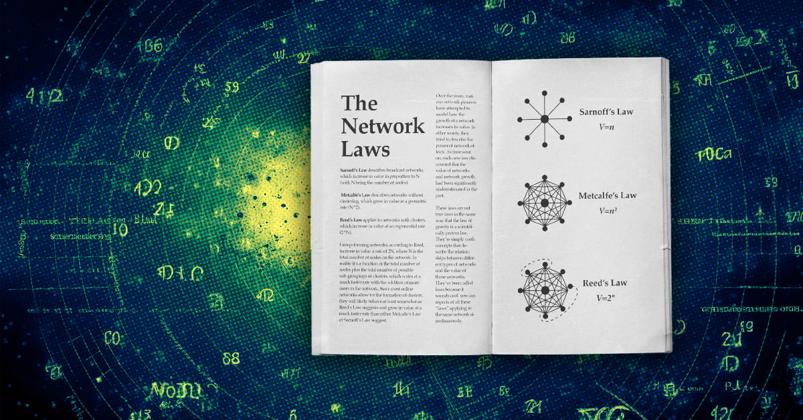

Network effects have been [responsible for 70% of all the value created in technology since 1994](https://www.nfx.com/post/70-percent-value-network-effects). Founders who deeply understand how they work will be better positioned to build category-defining companies.

自1994年以来，网络效应[创造了科技行业70%的价值](https://www.nfx.com/post/70-percent-value-network-effects)。深刻理解网络效应工作方式的创始人，将更有能力创建定义某一类别的公司。

This reference for Founders will be continually updated and includes a comprehensive collection of terms and insights related to network effects all in one place. It’s one of three definitive resources we’ve written about network effects, also including:

这本为创始人提供的参考资料将不断更新，其中包括与网络效应有关的各种术语和见解。这是我们撰写的有关网络效应的三大权威资料之一，其他资料还包括：

-   **[The Network Effects Manual](./The-Network-Effects-Manual.md)**, which describes the 16 different types of network effects  [网络效应手册](./The-Network-Effects-Manual.md)：文中描述了 16 中不同类型的网络效应；
-   [**The NFX Archives**](https://www.nfx.com/post/network-effects-archives), a compendium of the most insightful articles ever written about network effects and network science  [NFX 档案馆](https://www.nfx.com/post/network-effects-archives)：汇集了有关网络效应和网络科学的最有见地的文章。

## Roadmap  本文结构

1.  Why Network Effects Are Important  网络效应为什么重要？
2.  How Networks Work  网络如何运作？
3.  Properties of Networks  网络的特点
4.  Building and Maintaining Network Effects  网络效应的构建和维护
5.  Related Concepts  相关概念

View this presentation [on Slideshare](https://www.slideshare.net/NFXvc/the-network-effects-bible-95560213) ([PDF](../Elements/The-Network-Effects-Bible/The-Network-Effects-Bible-PPT.pdf))

本文相关的演示文稿可在 [Slideshare](https://www.slideshare.net/NFXvc/the-network-effects-bible-95560213) 查看（[离线版](../Elements/The-Network-Effects-Bible/The-Network-Effects-Bible-PPT.pdf)）

## Part I - Why Network Effects Are Important  第一部分：网络效应为什么重要？

Network effects are mechanisms in a product and business where every new user makes the product/service/experience more valuable to every other user.

网络效应是产品和业务中的一种机制。有了网络效应，每多出一个用户，都会使产品/服务/体验对其他的用户更有价值。

Network effects are important because they are the best form of defensibility, and thus value creation, in the digital world (the [three other major defensibilities](https://www.nfx.com/post/defensibility-most-value-for-founders) are brand, embedding, and scale).

网络效应之所以重要，是因为它们是数字世界中最好的防御形式，因此也是创造价值的最佳形式（另外的[三大防御形式](https://www.nfx.com/post/defensibility-most-value-for-founders)是品牌、内嵌和规模）。

As mentioned above, network effects account for the majority of value created in the technology industry in the past few decades, since many winner-take-all-companies in tech were powered by network effects.

过去几十年来，网络效应创造了科技行业中的绝大部分价值，因为科技领域中，许多赢家通吃的公司都是由网络效应推动的。网络效应，已经触及或即将触及每一个行业。

Not all network effects are the same, however, and understanding the nuances is essential for building network effects of your own into your products. Different types of nfx are stronger or weaker than others, and they each work differently. To date we’ve identified [16 different kinds of network effects](./The-Network-Effects-Manual.md). They’re listed as follows in order of strength:

然而，并非所有的网络效果都是相同的，理解网络效应中的细微差别，对你在自己的产品中构建网络效应是至关重要的。不同类型的网络效应的强度也不同，它们各自的工作方式也不同。到目前为止，我们已经确定了 [16 种不同的网络效应](./The-Network-Effects-Manual.md)。它们按强度排列如下：

1.  [Physical](https://www.nfx.com/post/network-effects-manual#physical-direct) (e.g. landline telephones) 物理直连网络效应（例如：固定电话）
2.  [Protocol](https://www.nfx.com/post/network-effects-manual#protocol-direct) (e.g. Ethernet) 协议网络效应（例如：以太网）
3.  [Personal Utility](https://www.nfx.com/post/network-effects-manual#personal-utility-direct) (e.g. iMessage, WhatsApp) 在线通讯网络效应（例如：iMessage、WhatsApp）
4.  [Personal](https://www.nfx.com/post/network-effects-manual#personal-direct) (e.g. Facebook) 社交产品网络效应（例如：Facebook）
5.  [Market Network](https://www.nfx.com/post/network-effects-manual#market-networks-direct) (e.g. HoneyBook, AngelList) 个体市场网络效应（例如：HoneyBook、AngelList）
6.  [Marketplace](https://www.nfx.com/post/network-effects-manual#marketplace-2-sided) (e.g. eBay, Craigslist) 双边交易平台网络效应（例如：eBay、 Craigslist）
7.  [Platform](https://www.nfx.com/post/network-effects-manual#platform-2-sided) (e.g. Windows, iOS, Android) （系统/应用）双边平台网络效应（例如：Windows、 iOS、 Android）
8.  [Asymptotic Marketplace](https://www.nfx.com/post/network-effects-manual#asymptotic-marketplace-2-sided) (e.g. Uber, Lyft) 边际价值递减型双边交易平台网络效应（例如：Uber、Lyft）
9.  [Data](https://www.nfx.com/post/network-effects-manual#data-network-effects) (e.g. Waze, Yelp!) 数据网络效应（例如：Waze、Yelp!）
10.  [Tech Performance](https://www.nfx.com/post/network-effects-manual#tech-performance-network-effects) (e.g. Bittorrent,Skype) 技术性能网络效应（例如：Bittorrent、Skype）
11.  [Language](https://www.nfx.com/post/network-effects-manual#language-social) (e.g. Google, Xerox) 语言网络效应（例如：谷歌、施乐）
12.  [Belief](https://www.nfx.com/post/network-effects-manual#belief-social) (currencies, religions) 信念网络效应（例如：货币、宗教）
13.  [Bandwagon](https://www.nfx.com/post/network-effects-manual#bandwagon-social) (e.g. Slack, Apple) 「跟风」网络效应（例如：Slack，Apple）
14.  [Expertise](https://www.nfx.com/post/network-effects-manual#Expertise) (Figma, Microsoft Excel) 专业技能网络效应（例如：Figma，微软 Excel）
15.  [Tribal](https://www.nfx.com/post/network-effects-manual#Tribal%C2%A0(Social)) (Apple, Harvard, NY Yankees…) 组织网络效应（例如：果粉，哈佛校友，纽约洋基队球迷）
16.  [Hub-and-Spoke](https://www.nfx.com/post/network-effects-manual#Hub-and-Spoke)  (TikTok, Medium, Craigslist) 中心辐射网络效应（例如：TikTok、Medium、Craigslist）

These network effects already touch, or will soon touch, every industry. Examples of how to apply the Network Effects Map can be found in this [Uber case study](https://www.nfx.com/post/the-network-effects-map-nfx-case-study-uber) and in this [Facebook case study](https://www.nfx.com/post/network-effects-facebook).

这些网络效应已经或即将触及每个行业。有关如何应用网络效应地图（Network Effects Map）的示例，可以参阅 [Uber 案例研究](https://www.nfx.com/post/the-network-effects-map-nfx-case-study-uber) 和 [Facebook 案例研究](https://www.nfx.com/post/network-effects-facebook)。

## Part II – How Networks Work 第二部分：网络如何运作？

Broadly speaking, networks are interconnected systems of people or things. Networks can be found in almost every complex system — anything from power grids and roads to social media and human brains. Networks of all types, however, share several common characteristics. Understanding the underlying components of networks is useful for Founders looking to build network effect businesses of their own.

广义上说，网络是人或事物相互联系的系统。你几乎可以在任何复杂的系统中找到网络：从电网、道路到社交媒体和人脑。不过，所有类型的网络都有几个共同的特点。了解网络的基本组成部分，对于希望建立自己的网络效应业务的创始人是有帮助的。

### Nodes and Links  节点和连接线

At a very basic level, networks are made up of nodes and links.

从最基本的层面来说，网络是由节点和连接线组成的。

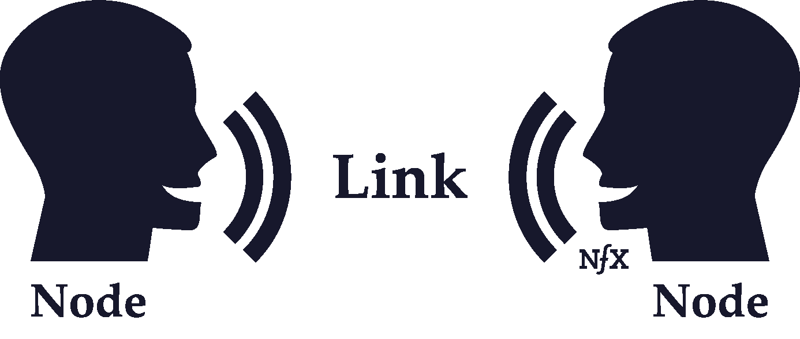
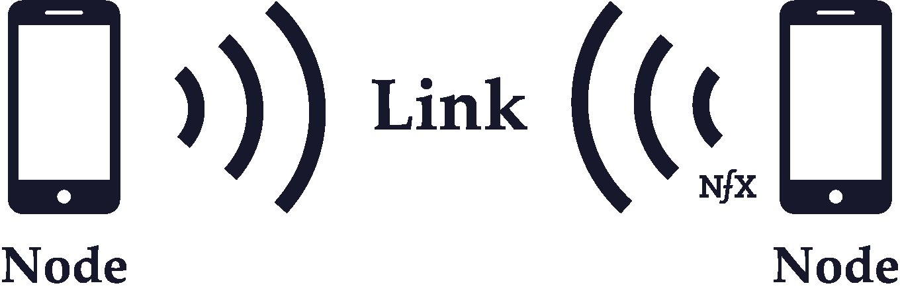

**Nodes** are the network participants: consumers, devices, customers, buyers, sellers, brokers, etc. Different types of nodes can have very different roles within the same network.

**节点**（Nodes）是网络的参与者：消费者、设备、客户、买家、卖家、经纪人等。不同类型的节点，在同一网络中可以有非常不同的角色。

Nodes within the same network can differ in terms of their levels of impact, influence, power, and value. **Central nodes** are the nodes in a network with a high number of links and are often more valuable. **Marginal nodes** have relatively few links and typically have less value — although there can be exceptions if marginal nodes are connected to a few powerful nodes themselves. Accurately calculating the value of a node varies greatly from network to network.

同一网络中的节点在影响因素、影响力、权力和价值方面可能有所不同。**中心节点**（Central nodes）是在网络中具有大量连接线的节点，通常更有价值。**边缘节点**（Marginal nodes）的连接线相对较少，通常价值较小——如果边缘节点可以直接连接到几个强大的节点，则可能会有例外。节点的价值因网络而异。

Finally, **network size** can be measured by the total number of nodes in a network. The size of a network alone doesn’t determine value, because the amount of activity in a network can vary.

最后，**网络规模**（network size）可以通过网络中节点的总数来衡量。网络的规模并不能决定网络的价值，因为网络中的活动量可能会有所不同。

**Links** are the connections between nodes or groups of nodes in a network. Not all links between the nodes in a network are equal. Links can vary (see below) in terms of directionality.

连接线（Links）是网络中节点或节点组之间的连接。并非网络中节点之间所有的连接线都是相等的。连接线的方向性可能会有所不同（见下文）。

Links vary in terms of strength, which is a function of the durability, closeness, and activity between two nodes. For instance, your Facebook Messenger link to your best friend is a lot stronger than your link to someone who you haven’t talked to since high school, but they both count as links in the Facebook Messenger network.

不同的连接线强度也会有所不同，这是一个关于两个节点之间的耐久性、紧密性和活动性的函数。例如，你和你最好朋友的 Facebook Messenger 连接线比你和高中以来就没有交谈过的人的连接线要强得多，但它们都可以被视为 Facebook Messenger 网络中的连接线。

### Network Density  网络密度

The density of a network is determined by its ratio of links to nodes. The higher the ratio, the denser the network.

网络的密度由其连接线与节点数量的比率决定。比率越高，网络越密集。

Typically, the higher the density of a network, the more powerful its network effects are. The interconnectivity of links serve to reinforce and strengthen the connections between other nodes. If you’re friends with someone, for instance, who is friends with all your other friends, the strength of your bond is likely to be stronger than it would be in isolation.

通常，网络密度越高，其网络效应就越强。连接线的互连性有助于加强其他节点之间的连接。例如，如果你和某人是朋友，而他又是你其他朋友的朋友，那么你们之间的联系强度就可能比仅仅你俩是朋友的情况大。

Density is typically distributed unevenly within a network. Certain areas within a network can have much higher density than other areas of a network (which is what leads to *clustering*, a phenomenon described in greater detail below).

在网络中，密度通常不是均匀分布的。网络中某些区域的密度可能比网络中其他的区域高的多（这是导致*集群*的原因，将在下面更详细地描述这一现象）。

In building products, it’s advisable to pay attention to how nodes form connections with each other so you can design your product to promote higher network density. Look for the **“white-hot center”** of your network — the densest, highest activity part —and focus the product features and language on activating other users to behave more like that group. Their activity will attract other nodes who will be inspired by the activity of the “white-hot” group, and it will radiate outward from there much faster than you might think.

在构建产品时，建议注意节点之间是如何形成联系的，以便设计产品的时候来提高网络密度。寻找你网络的“白热化中心”——最密集、最活跃的部分——并把产品特性和语言集中在激活其他用户的行为上，让他们表现得更像那个群体。他们的活动将吸引其他节点，这些节点将受到“白热化”群体活动的激发，从那里向外辐射的速度比你想象的要快得多。

### Directionality  方向性

In graph theory, which is an aspect of network science, a link between nodes can be either **directed** or **undirected**.

图论是网络科学的一个方面，在图论中，节点之间的连接线可以是**有向**的，也可以是**无向**的。

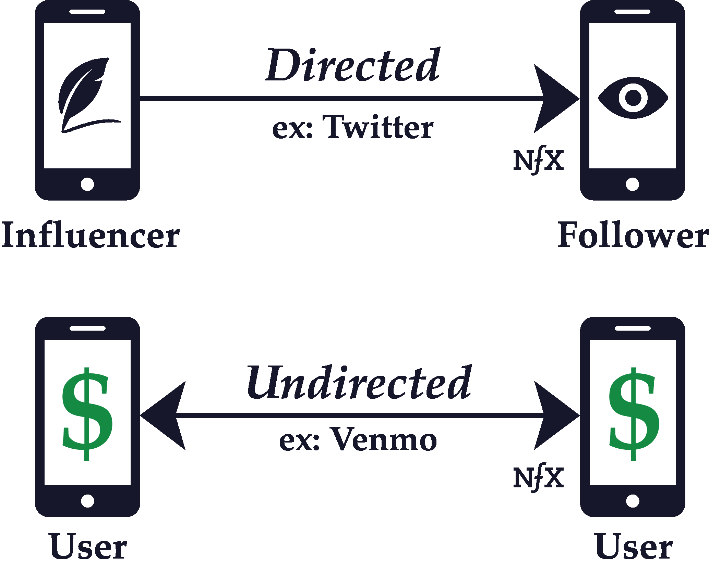

Whether a graph is directed or undirected depends on the nature of the connections between the nodes of a network. If the connections are directed, it means that one node points to the other in an unreciprocated fashion.

图是有向的还是无向的取决于网络节点之间连接的性质。如果连接是定向的，则意味着一个节点以非往复的方式指向另一个节点。

On a [Personal Network](https://www.nfx.com/post/network-effects-manual#personal-direct) like Twitter, for example, well-known people like celebrities and politicians have huge followings which they don’t reciprocate. The flow of information is mostly one way — from the bigger, more central nodes to the smaller, more marginal nodes.

例如，在 Twitter 这样的社交产品网络上，名人和政治家这样的知名人士有大量粉丝，他们基本上不会关注粉丝。信息的流动主要是单向的——从更大、更中心的节点到更小、更边缘的节点。

Contrast that with a [Personal Utility Network](https://www.nfx.com/post/network-effects-manual#personal-utility-direct) like Facebook Messenger or WhatsApp, where connections are necessarily reciprocal. If you have a conversation with someone on Facebook Messenger, the flow of information and interaction is bidirectional. So Facebook Messenger and WhatsApp are examples of networks with *undirected* connections.

相比之下，像 Facebook Messenger 或 WhatsApp 这样的在线通讯网络，连接必然是相互的。如果你在 Facebook Messenger 上和某人交谈，信息流动和互动是双向的。所以 Facebook Messenger 和 WhatsApp 是*无向连接*网络的例子。

The **direction** of a link between nodes in a network is determined by which way, if any, the interaction between nodes in a network flows. That interaction can include the transfer of money, information, communication, and anything else that can pass between nodes as they interact.

网络中节点之间的连接线**方向**，由网络中节点之间的交互流动的方式（如果有的话）决定。这种交互可以包括金钱、信息、通信以及在节点交互时可以在节点之间传递的任何其他东西。

A network that consists of directed links *only* is called a **digraph**, but true digraphs are rare. Usually, networks encompass a mixture of directed and undirected connections. Understanding the directionality of links in your network and mapping them visually leads to far better product design and prioritization of features.

*仅由*有向连接线组成的网络称为**有向图**（digraph），但真正的有向图很少。通常，网络都是有向连接和无向连接的混合体。理解网络中连接线的方向性，并直观地映射它们，可以更好地设计产品和优化功能。

### One-to-One vs One-to-Many  一对一与一对多

Relationships between nodes in a network can be one-to-one, or they can be one-to-many.

网络中节点之间的关系可以是一对一的，也可以是一对多的。

The key attribute of one-to-many connections is that they are *directed* links, where the flow of the interaction is unidirectional. One-to-one relationships, on the other hand, are usually functionally reciprocal. Therefore, they’re *undirected*. The interaction flows both ways.

一对多连接的关键属性是它们是*定向*连接线，其中交互流动是单向的。另一方面，一对一的关系通常在功能上是相互的。所以它们是*没有方向*的。互动是双向的。

In the example of Twitter discussed earlier, or other asymmetric-follow personal networks like Instagram or YouTube, there are central nodes with many followers (inbound directed connections), and there are marginal nodes without many followers. The marginal nodes in these examples are primarily observers, whereas the central nodes are content producers.

在前面讨论过的 Twitter 或其他非对称的社交产品网络（如 Instagram 或 YouTube）的例子中，有许多中心节点（定向连接），也有许多边缘节点。这些例子中的边缘节点主要是“观察”者，而中心节点是内容生产者。

Central nodes with one-to-many relationships can broadcast to marginal nodes, whereas the interaction that flows back is usually small to non-existent (think of the relationship of a celebrity and their followers on Instagram or a TV network and their viewers).

具有一对多关系的中心节点，可以将信息传递到边缘节点，而回流的交互通常很小，甚至不存在（想想明星和他们粉丝之间的关系）。

Central nodes also can exist in one-to-one connection networks like Facebook (although they eventually ended up adding a one-to-many “follow” feature themselves), where some users have many friends and others very few. But the potential for disparity isn’t as vast as it is with networks that allow for one-to-many networks.

中心节点也可以存在于像 Facebook 这样的一对一的连接网络中（尽管它们最终加入了一对多的“关注”功能），其中一些用户有很多朋友，而另一些用户很少。但差距并不像允许一对多的网络那么大。

### Clustering  集群

Within real-world networks, nodes are unlikely to be dispersed evenly. They tend to cluster or form local groupings that are more tightly knit than the network at large. When two clusters are connected by a solitary link, but are otherwise unconnected and isolated from each other, that link is called a **bridge.**

在现实网络中，节点的分布不太可能是均匀的。它们倾向于聚集或形成比整个网络更紧密结合的区域性群体。当两个集群通过一个单独的连接线连接，而在其他方面没有连接并且彼此隔离时，这个连接线就被称为**桥梁**。

Clustering can be witnessed in online personal utility networks like Slack or Facebook Messenger, where people form subgroupings that are more active than the broader network. You can probably see examples if you consider your own private use of those services. A similar clustering phenomenon also can be seen publicly on Twitter and YouTube among popular members of those networks.

在 Slack 或 Facebook Messenger 等在线通讯网络中可以看到集群，人们在这些网络中形成比更广泛的网络更活跃的子集群。如果你考虑自己对这些服务的私人使用，你可能会看到一些例子。类似的集群现象，也可以在 Twitter 和 YouTube 这类的网络上看到。

The networks with higher degrees of clustering, measured by a “clustering coefficient”, can have the very powerful network effects as described by Reed’s Law (more on this below), which posits exponential increases in value as a network grows. A network with a high clustering coefficient will increase exponentially in value while it grows, while a network with low clustering will increase in value at a slower rate. There are tactics for increasing the clustering coefficient in your network, although not all networks are equally susceptible to forming clusters.

用“集群系数”衡量的具有较高集群度的网络，可以具有里德定律（Reed’s Law）所描述的非常强大的网络效应（下面将对此进行更多描述），里德定律假设，随着网络的增长，网络的价值呈指数增长。具有高集群系数的网络，在增长的同时会以指数形式增加价值，而具有低集群系数的网络，将以较慢的速度增加价值。虽然并非所有网络都同样容易形成集群，但是有一些策略可以提高网络中的集群系数。

### Critical Mass  临界点

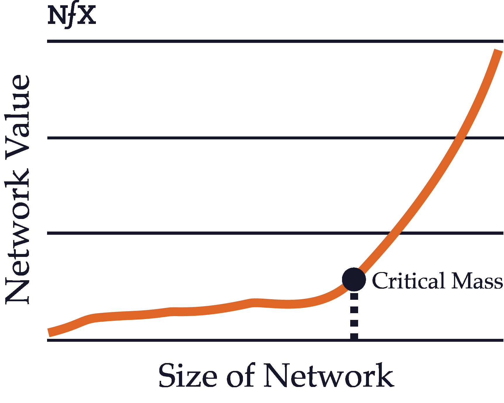

The critical mass of a network refers to the point at which the value produced by the network exceeds the value of the product itself and of competing products. This can happen at different times depending on the type of a network.

网络的临界点，是指网络产生的价值超过产品本身和竞争产品价值的点。这可能在不同的时间发生，主要取决于网络的类型。

For example, physical direct networks such as telephones gain critical mass quite early on. As the chairman of AT&T [pointed out back in 1908](https://www.nfx.com/post/network-effects-manual#direct-network-effects), “a telephone — without a connection at the other end of the line — is not even a toy or a scientific instrument. It is one of the most useless things in the world.” Since one telephone without any connections is utterly worthless, a telephone network with even two users has sufficient value to exceed the inherent value of a single product on its own.

例如，像电话这样的物理直接网络，在很早就获得了临界点。正如AT&T董事长[早在1908年就指出](https://www.nfx.com/post/network-effects-manual#direct-network-effects)的，“电话——如果线路另一端没有连接——甚至不是玩具或科学仪器。它是世界上最无用的东西之一。”由于一部没有任何连接的电话是完全没有价值的，一个连接两个用户的电话网络，本身就有足够的价值超过一个产品的固有价值。

Contrast that with a platform network like Windows or iOS. The value of the Windows operating system, even without any programs or applications, is quite high on its own. Only after the network of users and developers has grown quite large does the value of all the third-party programs, plus the value of the interoperability with other users, exceed the value (for users) of the Microsoft programs by themselves.

这与 Windows 或 iOS 等（系统/应用）平台网络形成了鲜明的对比。即使没有任何程序或应用程序，Windows 操作系统的价值也是相当高的。只有在用户和开发人员的网络变得相当大之后，第三方程序的价值加上与其他用户的互操作性的价值，才超过微软程序本身的价值。

Most products with network effects must ultimately reach critical mass in order to fully take advantage of the defensibility provided by their network effects. Before the size of the network reaches critical mass, the product remains quite vulnerable and may not have much value to users. For such products, the challenge is often to build enough initial value to incentivize early adopters to start using the product even before the network effects value has kicked in.

大多数具有网络效应的产品，只有达到临界点，才能充分利用其网络效应提供的防御性。在网络规模达到临界点之前，产品仍然非常脆弱，可能对用户没有多大价值。对于这样的产品来说，挑战往往是要建立足够的初始价值，以激励早期采用者开始使用该产品。

### The Network “Laws”  网络“定律”

Over the years, various network pioneers have attempted to model how the growth of a network increases its value. In other words, they tried to describe the power of network effects. As time went on, each new law discovered that the value of networks and network growth had been significantly *underestimated* in the past.

多年来，各种网络效应的先驱都试图模拟网络的增长，以及网络如何增加价值的。换句话说，他们试图描述网络效应的力量。随着时间的推移，每一项新的定律都发现，网络和网络增长的价值在过去被*严重低估*了。

These laws are not true laws in the same way that the law of gravity is a scientifically proven law. They’re simply math concepts that describe the relationships between different types of networks and the value of those networks. They’ve been called laws because it sounds cool. Sometimes you can have aspects of all these “laws” applying to the same network simultaneously.

这些定律并不是真正的定律。它们只是描述不同类型的网络之间的关系，以及这些网络的价值的数学概念。它们之所以被称为定律，只是因为听起来很酷。有时候，你可以让所有这些“定律”的各个方面同时适用于同一个网络。

#### Sarnoff’s Law  萨诺夫定律

David Sarnoff was a titan of broadcast era radio and TV, who led the Radio Corporation of America (which created NBC) from 1919 until 1970. It was one of the largest networks in the world during those years. Sarnoff observed that the value of his network seemed to increase in *direct proportion* to the size of the network — proportional to *N*, where *N* is the total number of users on the network.

大卫·萨诺夫（David Sarnoff）是广播时代广播电视业的巨人，1919 年至 1970 年期间，他领导着美国广播公司。那几年它是世界上最大的网络之一。萨诺夫观察到，他的网络价值似乎与网络规模*成正比*——与 N 成正比，N 是网络上的用户总数。

As it turned out, Sarnoff’s description of network value ended up being an underestimate for some types of networks, although it was an accurate description of broadcast networks with a few central nodes broadcasting to many marginal nodes (a radio or television audience).

事实证明，萨诺夫对网络价值的描述最终低估了某些类型网络的价值，尽管它准确地描述了由几个中心节点向许多边缘节点（广播或电视观众）广播的广播网络。

#### Metcalfe’s Law  梅特卡夫定律

Metcalfe’s Law states the value of a communications network grows in proportion to the square of the number of users on the network (*N*^2 where *N* is the total number of users on the network).

梅特卡夫定律指出，通信网络的价值，与网络上用户数的平方成正比( N^2，其中N是网络上的用户总数)。

The formulation of this concept, which dates to about 1980, is attributed to Robert Metcalfe, who was one of the inventors of the Ethernet standard.

这一概念的形成可以追溯到 1980 年左右，归功于以太网标准的发明者之一罗伯特·梅特卡夫（Robert Metcalfe）。

Metcalfe’s Law seems to hold because the number of links *between* nodes on a network increase mathematically at a rate of *N^2*, where *N* is the number of nodes. Although originally formulated to describe communication networks like Ethernet, fax, or phone networks, with the arrival of the internet it has evolved to describe social networks and marketplaces as well.

梅特卡夫定律似乎是成立的，因为网络上节点*之间*的连接线数量以N^2的速度增加，其中 N 是节点的数量。虽然最初是用来描述以太网、传真或电话网络等通信网络，但随着互联网的到来，它已经演变成了描述社交网络和市场网络的定律。

#### Reed’s Law  里德定律

Reed’s Law was published by David P. Reed of MIT in 1999. While Reed acknowledged that “many kinds of value grow proportionally to network size” and that some grow as a proportion to the square of network size, he suggested that “group-forming networks” that allow for the formation of *clusters* (as described above) scale value even faster than other networks.

里德定律是麻省理工学院的大卫·里德（David P. Reed）于1999年提出的。里德承认“多种价值与网络规模成正比增长”，有些价值与网络规模的平方成正比增长，但他认为，允许形成集群的“*集群网络*”（如上所述）的价值比其他网络的增长更快。

Group-forming networks, according to Reed, increase in value a rate of 2^N, where *N* is the total number of nodes on the network.

根据里德的说法，集群网络的价值增加了2^N倍，其中N是网络上节点的总数。

The reason why Reed suggested a formula of 2^N instead of N^2 is because the number of possible groups within a network that “supports easy group communication” is much higher than 1, so that the total number of connections in the network (the network density) is not just a function of the total number of nodes (N^2). In reality it’s a function of the total number of nodes *plus* the total number of possible sub-groupings or clusters, which scales at a much faster rate with the addition of more users to the network.

里德提出用2^N代替N^2的原因，是因为“支持简单集群通信”的网络中可能的集群的数量远远高于1，所以网络中的连接总数(网络密度)不仅仅是节点总数( N^2 )的函数。实际上，它是节点总数*加上*可能的子集群的函数，随着网络中用户的增加，它的扩展速度要快得多。

Since most online networks allow for the formation of clusters, they will likely behave at least somewhat as Reed’s Law suggests and grow in value at a much faster rate than either Metcalfe’s Law or Sarnoff’s Law suggest.

由于大多数在线网络允许集群的形成，它们可能至少会像里德定律所提出的那样，价值增长的速度比梅特卡夫定律或萨尔夫定律所指出的要快得多。

## Part III – Network Properties  第三部分：网络的特点

### Irregularity  不规则性

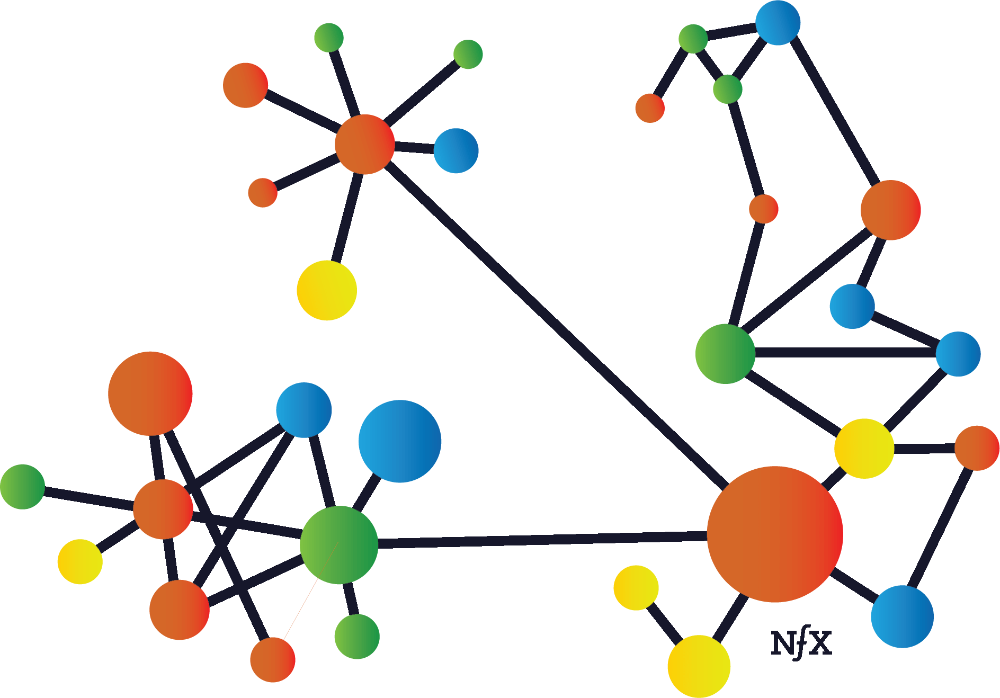

Networks are not usually uniform in real life. They just look that way in diagrams. They have clusters, hot spots, and dead spots. These mirror the irregularities of complex systems in the real world. Examples include geography (e.g. urbanites behave very differently than rural people), real-world relationship differences (manager-employee relationships are different from peer-level coworker relationships), size (a company with two people will make decisions differently than one with 30 people or 500 people), and many others.

网络在现实生活中通常是不一致的。它们只是在图表中看起来是这样的。它们有集群、热点和死角。这些反映了现实世界中复杂系统的不规则性。这方面的例子，有区位差异（例如，城市人和农村人的行为非常不同）、现实世界中的关系差异（经理与员工的关系不同于同级同事的关系）、规模差异（一家有两个人的公司会做出不同于一家有30人或500人的决定），以及其他许多方面。

You need to recognize these irregularities, find the “white-hot center” within the network, and focus on it initially to build up a network effect before you expand your focus to the broader network.

你需要认识到这些异常之处，找到网络中的“白热化中心”，在将你的注意力扩展到更广泛的网络之前，先关注它，来建立网络效应。

### Real Identity vs Pseudonymity vs Anonymity  真实身份、假名与匿名

Many network effect businesses require users to create a profile that’s visible to other nodes in the network. Networks with profiles tied to a node’s real identity, like your real personal name or real company name, are typically more effective at building network effects than networks with pseudonymous profiles (e.g. user-generated handles like “Tiger123”).

许多具有网络效应的公司，要求用户创建网络中其他节点可见的个人资料。具有与节点真实身份相关联的个人资料的网络——例如你的真实个人姓名或真实公司名称——通常比具有假名的个人资料的网络更有效地构建网络效应。

It’s not a coincidence that the three largest and most successful social networks in the Western World — LinkedIn, Facebook, and Twitter — are also the first that successfully offered real identity profiles at scale (although Twitter does allow the use of pseudonymous handles, the identities people use are usually tied to their real-world identity, e.g. “@realDonaldTrump”). All the hundreds of social networks that launched before real names became acceptable eventually died.

西方世界最大、最成功的三大社交网络——LinkedIn、Facebook 和 Twitter——也是第一批大规模成功提供真实身份资料的社交网络，这并非巧合（尽管 Twitter 确实允许使用假名，但人们使用的身份通常与其真实身份相关联，例如“@ realDonaldTrump”）。在实名制被接受之前推出的数百个社交网络最终全部消亡了。

Real Identity is also critical in two-sided marketplace and platform network effect businesses where trust and reputation facilitate the liquidity of transactions.

在信任和声誉促进交易流动性的双边市场和平台网络效应业务中，真实身份也很重要。

One caveat: there are some applications, in crypto or government spy work, where anonymity is a necessary feature of the network. Typically, however, such networks collapse in short order for three reasons: a) when the anonymity of the network breached and trust in the system ends, b) when what is being transferred between nodes becomes too low quality as anonymous free riders drag the network down, and 3) as the anonymous network becomes unacceptable to the rest of the world and authorities of various kinds (such as governments) step in.

有一点需要注意：在涉及到加密或政府间谍工作的一些应用中，匿名是网络的必要特征。然而，这种网络通常在短时间内崩溃有三个原因: 第一，当网络的匿名性遭到破坏并且对系统的信任终结；第二，节点之间传输的内容由于匿名，免费搭车者将网络拖垮而变得质量太低；第三，当世界其他地方和各种部门(例如政府)介入时，匿名网络变得不可接受。

And let’s be clear, with Telegram, for instance, while users’ messages are encrypted, they use it because it allows them to connect to real identities, not anonymous people. *Privacy is different from anonymity.*

让我们明确一点，以电报（Telegram）为例，当用户的信息被加密时，他们使用它是因为它允许他们连接到真实的身份，而不是匿名的人。*隐私不同于匿名*。

For more on this subject, see our essay “[Does Real Identity Matter for Networks?](https://www.nfx.com/post/real-identity)”

关于这个主题的更多信息，请参阅我们的文章《[网络的真实身份重要吗? ](https://www.nfx.com/post/real-identity)》

### Asymmetry  不对称性

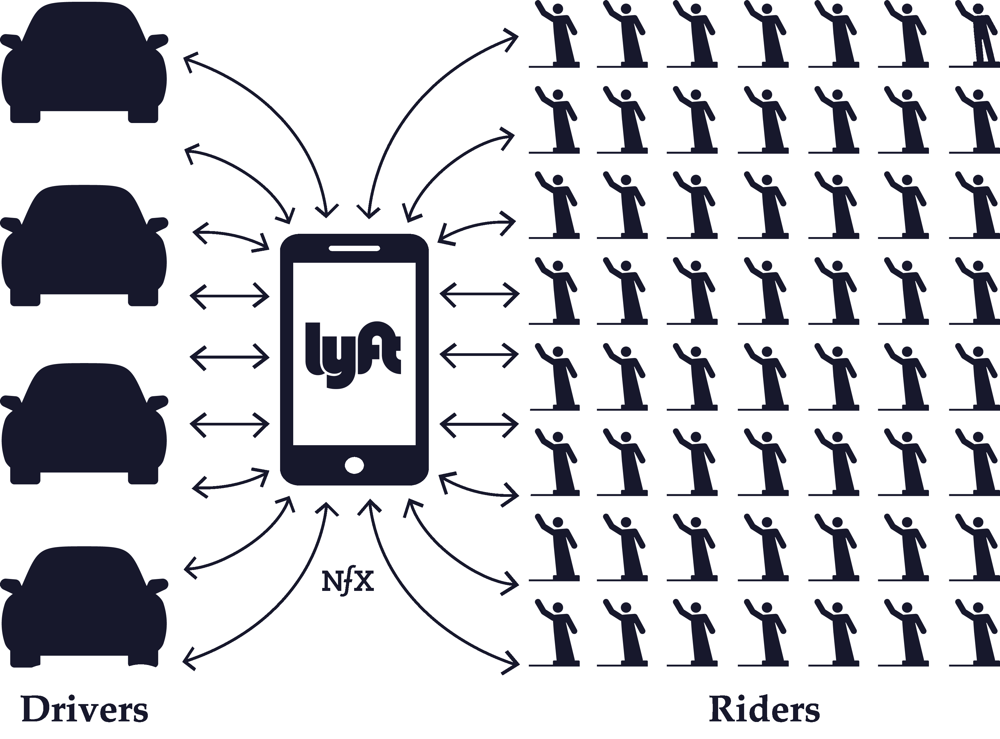

This term relates mostly to marketplaces, whether that marketplace is 1, 2, 3, or N-sided. In nearly every marketplace, one side, or one type of node, is harder to acquire than the other.

这个术语主要与交易平台有关，无论市场是 1、2、3 边的还是 N 边的。在几乎每个市场中，一个或一种类型的节点比另一个更难获得。

In some cases, the harder side of the marketplace is the demand side — the buyers. Usually in this scenario, if you can manage to attract people who are willing to pay (buyers), suppliers (sellers) will show up quickly and without as much effort. We call this a “demand-side marketplace”.

在某些情况下，交易平台更难的一面是需求面——买家。通常在这种情况下，如果你能设法吸引愿意付钱的人（买家），供应商（卖家）就会很快出现，而且不会付出太多的努力。我们称之为“需求侧市场”。

Fiverr and UpWork are examples who focus on finding *demand* and rely on supply to show up organically. Lending Club is another example. They focus their efforts on finding demand (borrowers) for the money, and the lenders show up on their own to provide the money for those borrowers.

Fiverr 和 UpWork 就是集中精力寻找*需求*、依靠供给的例子。Lending Club就是另一个例子。他们集中精力寻找资金需求(借款人)，贷款人自己出面为借款人提供资金。

In some cases, the harder side is the supply, and demand-side users are attracted to the marketplace organically once the supply side is robust. We call this a “supply-side marketplace.” For instance, Uber and Lyft spend the majority of their paid acquisition budget on driver acquisition — the *supply* side. Similarly, OpenTable had to slowly acquire restaurants, the supply side, one by one, until it had built up enough supply after seven years to attract demand (people looking to make restaurant reservations).

在某些情况下，更难的一面是供应，一旦供应方变得强劲，需求方用户就会有机地被市场吸引。我们称之为“供应侧市场”。例如，Uber 和 Lyft 将大部分预算用于司机获取——也就是*供应方*。同样，OpenTable 也不得不慢慢获取餐厅，供应方一个接一个，直到七年后，它积累了足够的供应来吸引需求（人们希望预订餐厅）。

Of course, in some markets, if you are unlucky or unwise in your target sector, you will find that both sides are equally hard to attract. That makes things very hard.

当然，在一些市场上，你会发现双方都难以吸引。这让事情变得非常困难。

Another asymmetry in marketplaces relates to the asymmetry *within* a side or within a type of node. In other words, not all supply or demand is made equal. Typically, there are certain nodes who will prove more valuable to get on your network, sometimes proving up to 1,000X more valuable than other nodes.

市场中的另一个不对称，涉及一个侧面或一种节点*内部的*不对称。换句话说，并不是所有的供给或需求都是平等的。通常，在网络中，某些节点会被证明是更有价值的，有时比其他节点价值高出 1000 倍。

Look for these various asymmetries in a marketplace and prioritize which types of demand or supply will be the best to attract first, second, and third. Then focus on developing tactics to crack the highest-value target first.

在市场中寻找这些不同的不对称，并优先考虑哪种需求或供应最能吸引第一、第二和第三种需求。然后集中精力发展策略，先破解最高价值目标。

### Homogeneous vs. Heterogeneous Networks  同构与异构网络

Homogeneous networks are networks where all the nodes have the same function in the network. One user is interchangeable with the next in the basic function they perform. In a landline telephone network, for example, each node (telephone) performs basically the same function as any other, and people tend to get telephones for the same reasons. Telecommunications networks, in general, are often homogeneous.

同构网络，是指网络中所有节点具有相同功能的网络。一个用户在执行的基本功能上可以与下一个用户交互。例如，在固定电话网络中，每个节点(电话)可以执行与其他节点基本相同的功能，人们倾向于出于相同的原因获得电话。电信网络通常是同构的。

Heterogeneous networks are networks where there are two or more classes of nodes categorized by both function and utility. On the Honeybook market network, event planners behave differently than photographers, who behave differently from florists. Buyer nodes on eBay are on the network for fundamentally different reason from seller nodes.

异构网络是指存在两种或两种以上按功能和效用分类的节点的网络。在Honeybook市场网络上，活动策划人的行为与摄影师不同，摄影师的行为与花店老板不同。eBay上的买家节点与卖家节点也有着根本的不同。

### Asymptotic Network Effects  渐近网络效应

Asymptotic network effects are network effects with diminishing returns.

渐近网络效应是收益递减的网络效应。

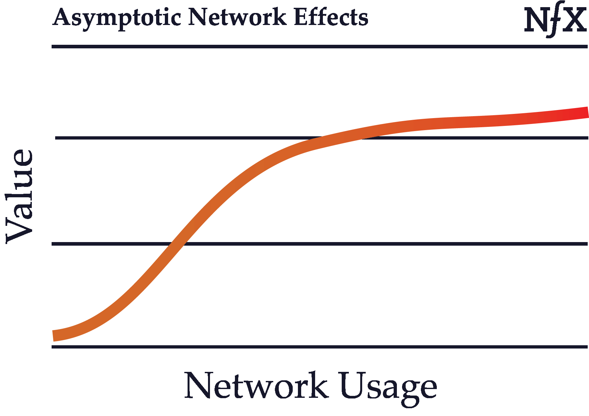

Recall the basic definition of network effects: as usage of a product grows, its value to each user also grows. In some cases, however, network effects can start to weaken after certain point in the growth of the network. Growth in an asymptotic network, after a certain size, no longer benefits the existing users.

回想一下网络效应的基本定义：随着产品使用量的增长，它对每个用户的价值也在增长。然而，在某些情况下，在网络增长的某一点之后，网络效应可能开始减弱。渐进网络的增长，在达到一定规模后，就不再惠及现有用户了。

Uber is one example of this, since after about a 4-minute wait time, Uber passengers no longer benefit much from an increase in the number of drivers. The value of more supply “asymptotes” as the growth in value approaches zero for the demand side.

Uber 就是一个例子，因为在大约 4 分钟的等待时间之后，Uber 的乘客就不再从司机数量的增加中受益了。随着需求方价值增长趋近于零，更多供应的价值也接近于零。

Many data network effects, for example, are asymptotic. After the dataset reaches a certain size, the algorithm no longer meaningfully improves as the dataset grows. Most data network effects suffer from this property. Businesses like Waze do the best job of avoiding this, because that service requires real-time data that must be continually updated by thousands or even tens of thousands of nodes to be minimally useful.

例如，许多数据网络效应是渐进的。数据集达到一定大小后，随着数据集的增长，算法不再有意义地改进。大多数数据网络效应都受到此属性的影响。像 Waze 这样的公司最有效地避免了这种情况，因为这种服务需要实时数据，这些数据必须由数千甚至数万个节点不断更新，才能最大限度地发挥作用。

### Same-Side Network Effects  同侧网络效应

Same-side network effects are *direct* network effects that occur on the same side of a multi-sided (2-sided or N-sided network). Same-side network effects refer to the change in value that occurs for users on the same side with the addition of users on that side.

同侧网络效应是发生在多边（双边或 N 边网络）同一边的*直接*网络效应。同侧网络效应是指随着同侧用户的增加，同侧用户的价值发生变化。

For example, Uber actually has *negative* same-side network effects or a congestion effect. That’s because at any given time, a greater number of riders means a higher price point or a higher wait time per ride. The same is true for drivers — more Uber drivers mean more competition for other drivers.

例如，Uber 实际上具有*负面的*同侧网络效应或拥塞效应。这是因为在任何给定的时间，更多的乘客意味着更高的价格点或更长的等待时间。司机也是如此——Uber 司机越多，其他司机的竞争就越激烈。

Same-side network effects can also be positive, however. This is the case for Windows users, who benefit from the addition of new Windows users because of file compatibility. Two Windows users can easily share files amongst themselves, and the number of people you can share files with grows with the number of people using the same platform.

不过，同侧网络效应也可能是积极的。对于 Windows 用户来说，情况就是这样，因为文件兼容性，Windows 用户可以从添加新的 Windows 用户中获益。两个 Windows 用户可以轻松地在他们之间共享文件，并且可以共享文件的人数随着使用同一平台的人数的增加而增加。

### Cross-Side Network Effects  交叉网络效应

Cross-side network effects are *direct* network effects that arise from complementary goods or services in a network with more than one side. As opposed to indirect network effects, cross-side network effects refers specifically to the direct increase in value to users on one side of a network by the addition of users to another side.

交叉网络效应是指在一个具有多边的网络中，由互补商品或服务产生的*直接*网络效应。与间接网络效应不同，交叉网络效应具体是指通过将用户添加到网络的另一边，使网络的一边用户的价值直接增加。

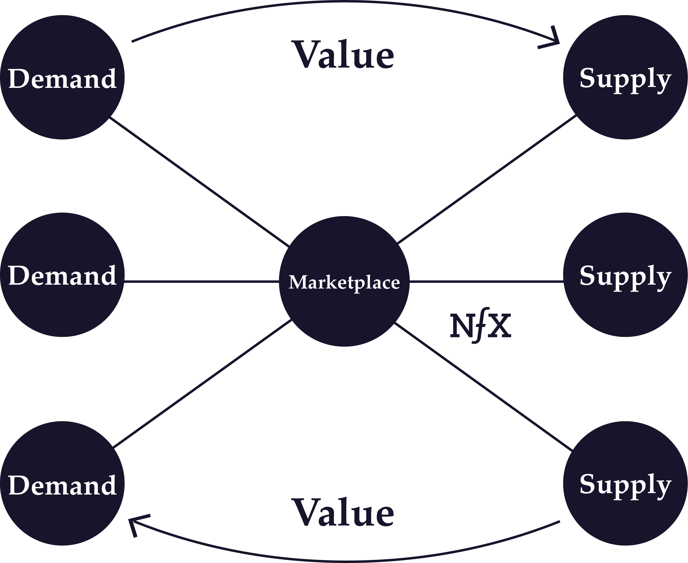

So to take the example of Uber yet again: there are large positive cross-side network effects because each additional driver adds direct value to all the users on the passenger side ([up to a point](https://www.nfx.com/post/the-network-effects-map-nfx-case-study-uber)) and vice versa.

再以 Uber 为例，它有很大的积极的交叉网络效应，因为每个额外的司机都直接为乘客这一边的所有用户增加价值（[直到某一点](https://www.nfx.com/post/the-network-effects-map-nfx-case-study-uber)），反之亦然。

### Indirect Network Effects  间接网络效应

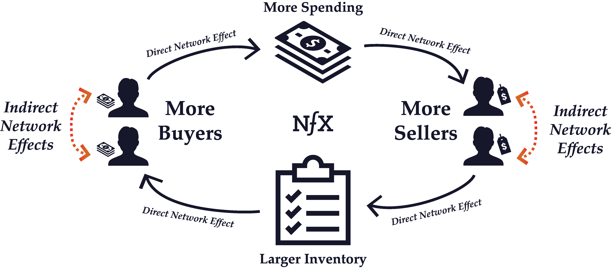

Indirect network effects occur when the value of a network increases as a result of one type of node benefitting another type of node directly, but not directly benefiting the other nodes of its same type. Same-side nodes *indirectly* benefit each other because they create an increased incentive for complementary users on the other side of the network to use the network, which in turn benefits all the nodes on the same side.

当一个网络的价值，由于一种类型的节点直接受益于另一种类型的节点，而不是直接受益于同一类型的其他节点而增加时，就会产生间接的网络效应。同侧的节点会*间接*相互受益，因为它们增加了网络另一边互补用户使用网络的激励，这反过来又使同边的所有节点受益。

For example, in a 2-Sided Marketplace like eBay, the addition of a new seller does not directly benefit other sellers. In fact, another seller just means more competition for all the other eBay sellers. However, because an expanded inventory of goods makes the marketplace as a whole more attractive to buyers, additional sellers end up indirectly benefiting other sellers because of the total increase in potential customers. There’s a powerful *indirect* growth in the value of the network for sellers with every new seller.

例如，在 eBay 这样的双边市场上，新卖家的加入并不会直接惠及其他卖家。事实上，另一个卖家只是意味着所有其他eBay卖家的竞争更加激烈。然而，由于商品库存的扩大使整个市场对买家更具吸引力，由于潜在客户的增加，更多的卖家最终间接惠及其他卖家。对于每一个新卖家来说，网络的价值都有一个强大的*间接*增长。

OS platforms like Microsoft Windows are another good example of indirect network effects at work. New Windows developers don’t directly benefit other developers. However, with an increased library of Windows programs, the number of Windows users will grow. And a greater number of windows users are beneficial for all developers because it increases the pool of potential customers for their programs.

微软 Windows 等操作系统平台是间接网络效应的又一个很好例子。新的 Windows 开发人员不会直接惠及其他开发人员。然而，随着 Windows 程序库的扩大，Windows 用户的数量将会增加。更多的 Windows 用户对所有开发人员都有利，因为这增加了他们程序的潜在客户群体。

This [1992 NYU paper](http://www.stern.nyu.edu/networks/jie92abs.html) by Economides and Salop is one of the earliest studies of indirect network effects, which it says is a function of the value of “compatible complementary goods”.

Economides 和 Salop 1992 年在纽约大学发表的这篇[论文](http://www.stern.nyu.edu/networks/jie92abs.html) 是最早研究间接网络效应的论文之一，论文称间接网络效应是「兼容互补商品」价值的函数。

### Negative Network Effects  负面网络效应

In some situations, more network usage or greater network size can actually decrease the value of the network, leading to **negative network effects**.

在某些情况下，更多的网络使用或更大的网络规模实际上会降低网络的价值，从而导致**负面的网络效应**。

Negative network effects can happen in two ways: **network congestion** (increased usage) and **network pollution** (increased size).

负面的网络效应可以通过两种方式发生：**网络拥塞**（增加使用量）和**网络污染**（增大规模）。

The most familiar example of network congestion is road traffic. During rush hour, every additional car on the road makes the network of roads in a city more clogged up (i.e. less valuable) for other drivers. Similar congestion can take place in telecommunications networks, although it is rarer for online networks.

最常见的网络拥堵例子是道路交通。高峰时，路上每多开一辆车，城市的道路网络就会对其他司机造成更大的堵塞（即价值更低）。类似的拥塞可能发生在电信网络中，尽管在线网络更少。

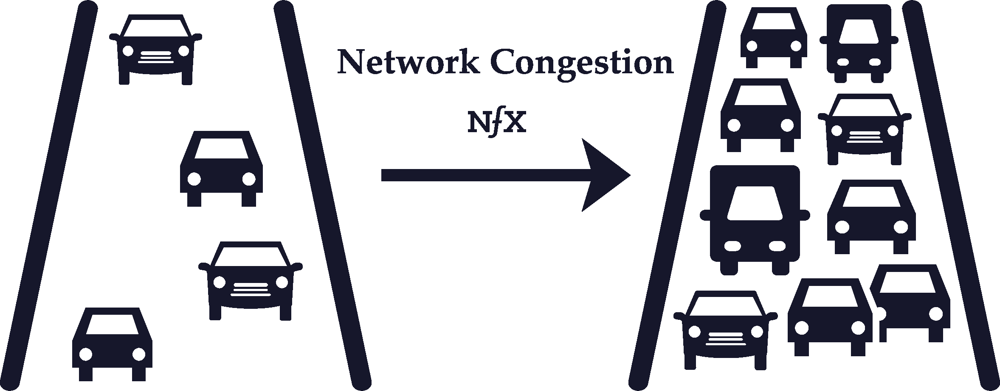

Network pollution, however, is more common for online networks. The wider your social graph grows on Facebook, for example, the more polluted your Facebook News Feed becomes with irrelevant or undesired content from acquaintances you barely know or professional contacts/family members.

然而，网络污染在在线网络中更为常见。例如，你在 Facebook 上的社交图谱越广，你的 Facebook 新闻提要就会受到越多来自你几乎不认识的熟人或职业联系人/家庭成员的无关或不受欢迎的内容的污染。

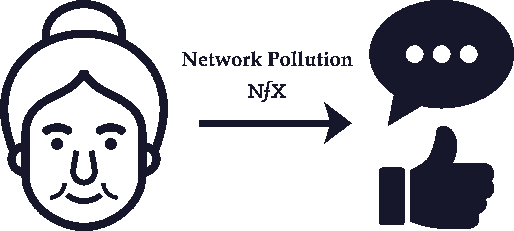

It’s possible for networks to have negative and positive network effects at the same time. Twitter and Facebook are two of the best examples, as both Twitter and Facebook feeds show you many people in your network, but if it’s too many, the feed can get polluted.

网络有可能同时产生消极和积极的网络效应。Twitter 和 Facebook 是两个最好的例子，因为 Twitter 和 Facebook 的 Feed 都是展示你网络中人们的信息，但是如果人太多，Feed 就可能会被污染。

It’s important for Founders to be aware of this so they can build product features to mitigate negative network effects as much as possible while fostering positive network effects.

对于创始人来说，意识到这一点非常重要，这样他们可以构建产品特性，以尽可能减少负面网络效应，同时培养正面网络效应。

## Part IV – Building and Maintaining Network Effects  第四部分：网络效应的构建和维护

### Multiplayer vs. Single-Player Mode  多人与单人模式

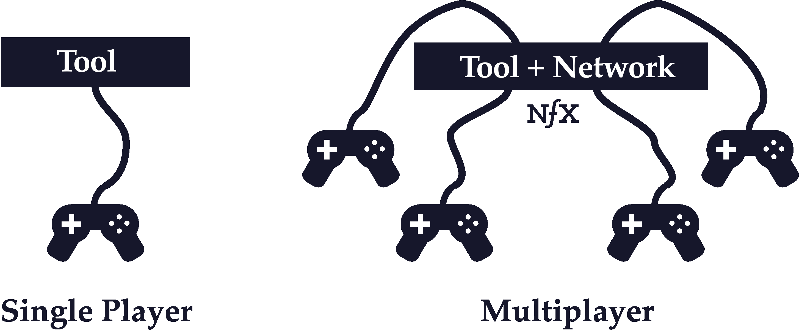

These are terms typically used in the gaming industry. We use them to discuss network effects businesses because they highlight an important distinction.

这些术语通常用于游戏行业。现在，我们用它们来讨论网络效应业务，因为它们突出了一个重要的区别。

A single-player product helps the user alone, and can be used without other users there. The user gets value from a product/service in isolation. For instance, buying something off Amazon. Or filing your taxes on TurboTax. Or implementing Stripe on my ecommerce site. It works for me right away, but I get no value from the fact others are also implementing Stripe on their sites.

单人产品可以单独帮助用户，可以在没有其他用户的情况下使用。用户单独从产品/服务中获得价值。例如，在亚马逊购买一些东西，但是其他人在亚马逊上买东西，对用户来说是没有价值的。

Users pay for a single-player product based the value it provides them directly, which tends to be linear. All the burden is on you to make your product increasingly more valuable to your customers. This is true of most SaaS companies like WorkDay or Oracle.

用户购买单人的产品，主要是基于其直接提供的价值，这种价值往往是线性的。所有的负担都会落在你身上，让你的产品对你的客户越来越有价值。大多数 SaaS 公司都是这样，比如 WorkDay 或 Oracle。

“Multiplayer” products, by contrast, let their users feel the presence and impact of the other users of the product, but have a hard time being useful without those other users. Multiplayer products let users add value to each other through their actions, even if it’s just viewing something, like on YouTube. Vimeo, without comments and without video view count, is a single player experience. YouTube, with view count and comments, is a multiplayer experience.

相比之下，“多人”产品让它们的用户感受到了产品其他用户的存在和影响，但是没有其他用户很难发挥作用。多人产品让用户可以通过他们的行为来增加彼此的价值。

It is possible for products to have single-player value *and* multiplayer value. For instance, HoneyBook has a tool that lets event planners make more beautiful proposals for their clients. Over time, as more photographers, caterers, and florists join the HoneyBook network, the event planner benefits from the professional network and N-sided payments network that begin to accrue.

产品可以同时具有单人价值*和*多人价值。例如，HoneyBook 有一个工具，可以让活动规划者为他们的客户提出更好的建议。随着时间的推移，随着越来越多的摄影师、餐饮经营者和花店加入HoneyBook网络，活动策划人从开始累积的专业网络和N边网络中受益。

It is also very possible for companies to add multiplayer mode to a single-player product, or even to switch their products from single-player to multiplayer. We help companies do that frequently. For instance, Amazon added multiplayer experiences with reviews, allowing past purchasers to benefit future purchasers. They also added a marketplace where hundreds of thousands of sellers joined and began adding value to buyers. For the first time in their history, Amazon’s Marketplace accounts for over 50% of the total units sold according to the [2017 annual report](http://phx.corporate-ir.net/phoenix.zhtml?c=97664&p=irol-proxy). This is a huge shift.

公司也很有可能在单人产品中添加多人模式，甚至将产品从单人切换到多人模式。例如，亚马逊在评论中增加了多人模式体验，让过去的购买者为未来的购买者提供价值。他们还增加了一个第三方市场，成千上万的卖家加入其中，开始为买家增加价值。根据 [2017 年年度报告](http://phx.corporate-ir.net/phoenix.zhtml?c=97664&p=irol-proxy)，亚马逊的 Marketplace 在销售总量中首次占到 50%  以上。这是一个巨大的转变。

We don’t suggest building single-player-only businesses. They tend to grow linearly and get dragged down by competition.

我们不建议直接建立单人模式的业务。它们倾向于线性增长，并容易被竞争拖垮。

### Switching Costs  转换成本

Switching costs refer to the costs in time, effort, or money that arise when you switch from using one product to another incompatible product. When switching costs are high, it tends to create customer **lock-in** because the customer has more of an incentive to stick with the same supplier throughout their life cycle.

转换成本是指，当你从一种产品切换到另一种不兼容的产品时所产生的时间、精力或金钱成本。当转换成本较高时，往往会造成**客户锁定**，这种情况下，客户更倾向于在整个生命周期中与同一个供应商保持联系。

Switching costs are related to the defensibility of a business, and also have a lot to do with product compatibility. Companies with high defensibility can usually afford to make their products incompatible with competitors, introducing steep switching costs.

转换成本与公司的防御性有关，也与产品兼容性有很大关系。防御性强的公司通常能够负担得起使其产品与竞争对手不兼容的费用，从而产生高昂的转换成本。

Think of Apple. Buying an Apple product such as a MacBook introduces a whole host of switching costs for incompatible products. If you buy a MacBook, it’s costly to own an Android from an effort perspective because you can’t sync your phone to your computer as easily, you have to use a different calendar application, etc. And when you buy a song or a movie or a book on iTunes, there are high switching costs to then using Spotify or Hulu or Kindle because the libraries are not compatible and your media will be scattered across incompatible services.

想想苹果。购买苹果产品（如 MacBook），会为不兼容的产品带来大量转换成本。如果你买了 MacBook，从工作的角度来看，拥有一个 Android 会很费力气，因为将手机上的信息同步到电脑上很难，你必须使用不同的日历应用程序等等。当你在 iTunes 上购买歌曲、电影或书籍时，使用 Spotify、Hulu 或 Kindle 的切换成本很高，因为这些都不兼容，你的东西将分散在不兼容的服务中。

All of this creates a lock-in effect for Apple customers, who have to buy everything from Airpods to Apple TVs in order to keep their electronic devices inter-compatible.

所有这一切，都为苹果的消费者创造了一种锁定效应，他们不得不购买从 Airpods 到苹果电视的所有东西，以保持他们电子设备的兼容性。

Network effects heighten switching costs like these even further. Not only is it costly from a compatibility perspective to switch products, but when the product has network effects, switching costs are heightened on a group as well as an individual level. For example, on a 2-Sided Marketplace like Craigslist, there are high switching costs for apartment renters as a group, because unless apartment seekers all move to a new marketplace at the same time as the renters, it’ll be too prohibitively costly for the renters to leave. Therefore the two sides of the marketplace lock each other into place.

网络效应进一步增加了这样的转换成本。不仅从兼容性的角度来看，切换产品的成本很高，而且当产品具有网络效应时，转换成本在群体和个人层面上都有所增加。例如，在 Craigslist 这样的双边市场上，作为一个群体，公寓租赁者的转换成本很高，因为除非寻求公寓的人都和租赁者同时搬到新市场，否则租赁者离开的成本太高，令人望而却步。因此，就成了市场的两边相互锁定的情况。

### Chicken or Egg Problem (Cold Start Problem)  鸡或蛋问题（冷启动问题）

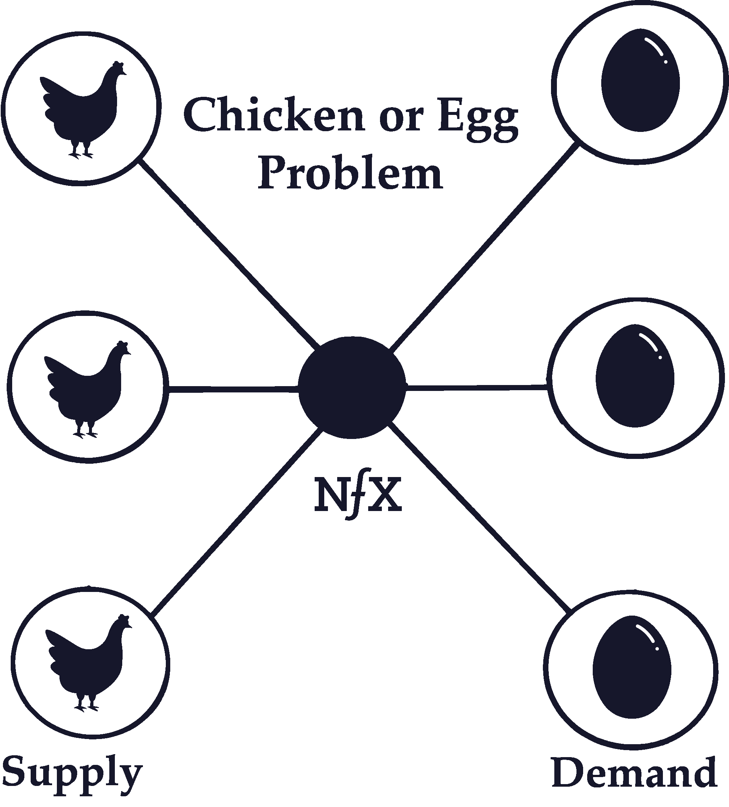

The “chicken or egg” problem refers to the problem of getting enough critical mass to trigger a positive feedback loop. If the people on a network produce the majority of value for other users, how do you get the first users to join?

“鸡还是蛋”问题是指到达临界点，来触发正反馈回路的问题。如果网络上的人能为其他用户创造大部分价值，那你如何让第一个用户加入？

This is an especially big problem with [2-Sided Marketplaces](https://www.nfx.com/post/network-effects-manual#marketplace-2-sided) (and to a lesser extent with [2-Sided Platforms](https://www.nfx.com/post/network-effects-manual#platform-2-sided)) because there are two types of users — buyers and sellers (or developers and users) — and one needs to be in place before the other one will have an incentive to join. Kickstarting 2-sided networks requires giving some sort of initial value to the users on one side or another, which is independent of the complementary value that results from the other side of the network being there.

这对于双边市场来说，是一个特别大的问题，因为有两种类型的用户——买家和卖家（或者开发商和用户），只用一种到位，另一种才有动力加入。Kickstarting 双边网络需要给一边或另一边的用户某种初始值，这与网络另一边在那里产生的互补值无关。

There are at least [19 specific tactics we know of that can help solve this problem](https://www.nfx.com/post/19-marketplace-tactics-for-overcoming-the-chicken-or-egg-problem). Several of them involve creating a single-player mode product that provides value to one side of the marketplace even without a network in place. Others involve attracting one side of the marketplace with compensation, such as cash or leads.

我们总结了至少 [19 种具体的策略可以帮助解决这个问题](https://www.nfx.com/post/19-marketplace-tactics-for-overcoming-the-chicken-or-egg-problem)。其中有几项涉及创建一个单人模式的产品，即使没有网络也能为市场的一边提供价值。另一些则涉及到用补偿吸引市场的一边，如现金等。完整的列表后续将会发布出来。

### Multi-Tenanting  多租户

Multi-tenanting occurs when there are low costs or no costs to simultaneously participating in competing networks at the same time.

当同时参与竞争网络的成本较低或没有成本时，就会出现“多租户”现象。

This is fairly rampant with social networks. People often syndicate photos or snaps that they share to multiple platforms at the same time (Facebook, Instagram, and Snapchat). It’s also frequent with marketplaces; many people on both sides of the marketplace often use both Uber and Lyft, both eBay and Craigslist, both Etsy and Amazon Marketplace.

这在社交网络中相当普遍。人们经常将他们的照片同时分享到多个平台（ Facebook、Instagram 和 Snapchat）。这在市场网络上也很常见；市场两边的许多人经常同时使用 Uber 和 Lyft，eBay 和 Craigslist，Etsy 和亚马逊 Marketplace。

Multi-tenanting can harm the defensibility of a network and mitigate network effects, but only up to a point. Ultimately, the bigger network will win out because it will have a higher profile for potential new customers and will be more likely to retain existing customers, even if those customers occasionally multi-tenant. Because the network is bigger, the number of options will be greater and people will only turn to competing networks in moments of dissatisfaction or as a supplement for the value provided by the larger network.

多租户可能在一定程度上损害网络的防御能力，减轻网络效应。最终，更大的网络将获胜，因为它将对潜在的新客户具有更高的知名度，更有可能保留现有客户，即使这些客户偶尔会有多租户。因为网络越大，选择的数量就会越多，人们只会在不满的时候求助于竞争的网络，或者作为对更大网络所提供价值的补充。

For example, people who use Snap stories may use Instagram stories to reach a different audience. Usage of one service may serve to reinforce and increase usage of the other service as people become more habituated to using both and see greater value from the broad category of “stories” shared on both.

例如，使用 Snap stories 的人可以使用 Instagram stories 来吸引不同的受众。随着人们越来越习惯于同时使用一种服务和增加对另一种服务的使用，并从两种服务共享的广泛“stories”类别中看到更大的价值，使用一种服务可能有助于加强和增加对另一种服务的使用。

Customers of eBay or Amazon might look to Etsy specifically for vintage products, and although this is a case of multi-tenanting, usage of one reinforces the other because the greater the variety of goods consumers buy online, the more likely they are to shop online.

eBay 或亚马逊的消费者可能会特别关注 Etsy 的古董产品，虽然这是一种多租户的情况，但使用一种会加强另一种，因为消费者在网上购买的商品种类越多，他们在网上购物的可能性就越大。

### Disintermediation  去中介化

Disintermediation is a vulnerability that mostly applies to Marketplaces and Market Networks. It happens when, after initially connecting through a marketplace or market network product, users take future transactions off the product and transact directly. This is a significant problem because retention leading to repeat purchase is the name of the game in most transactional networks.

去中介化主要适用于市场和市场网络。当用户最初通过市场或市场网络产品进行连接后，从产品上取消未来的交易并直接进行交易时，就会发生这种情况。这是一个很大的问题。

To help prevent disintermediation, you can provide tools, reputation, insurance, compliance, leads and other incentives. There is an extensive playbook about the many things you can try if your marketplace is challenged with this problem. Some never overcome it.

为防止去中介化，你可以提供工具、声誉、保险、合规、销售线索和其他奖励。如果你的市场受到这个问题的挑战，你可以尝试做很多事情。但是，有些网络永远都无法克服这个问题。

### Retention  用户留存

Retention is about how often your users return to use your product, and this can make a big difference in network effects. If you have low retention, then it will be very difficult to capture any sort of network effects even as your userbase grows, because the overall usage of your product won’t increase and you’ll lose your defensive position.

留存指的是，用户返回使用产品的频率，这可能会对网络效果产生很大影响。如果你的留存率很低，那么即使你的用户群体增加了，也很难捕捉到任何类型的网络效应，因为你的产品的总体使用量不会增加，你将失去防御地位。

In the early days, Facebook had sky-high retention rates. People who signed up kept on using it, so there was mounting value from the network because if you joined later than your friends, chances are high that they’d still be using it and you’d get value from joining. If retention was low, then if you joined too late you’d have missed the trend and you’d be much less likely to stick around yourself.

在早期，Facebook 拥有极高的留存率。注册它的人一直在使用它，所以网络的价值越来越大，因为如果你比你的朋友加入得晚，他们仍在使用它的可能性很大，你会从加入中获得价值。如果留存率低，那么如果你加入的太晚，你就会错过这个趋势，你就不太可能坚持下去。

Networks without effective retention have weak network effects, and weak network effects lead to low retention. Remember that network effects don’t come from the size of the network, but from overall usage.That’s why growing a network’s size isn’t enough, it’s also important to focus on increasing usage.

没有有效留存的网络，网络效应会很弱，较弱的网络效应导致较低的留存率。请记住，网络效应不是来自网络的大小，而是来自整个用户群体的使用。这就是为什么扩大网络规模是不够的，还必须注重增加使用量。

## Part V - Related Concepts  第五部分：相关概念

### Geometric (Exponential/Non-Linear) Growth vs. Linear Growth  几何（指数/非线性）增长与线性增长

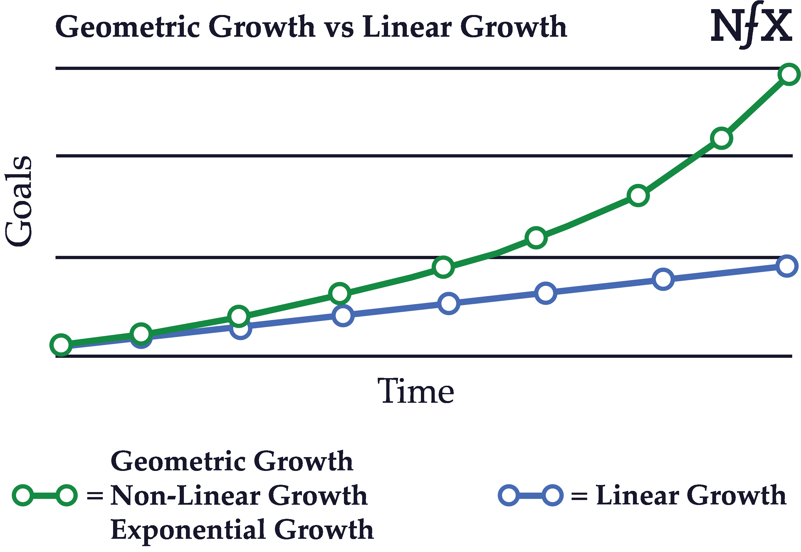

Businesses with neither viral effects nor network effects tend to produce linear, straight-line growth. Linear growth can produce a business, but not the kind of high impact, exciting growth we’re all looking for. We all want the green-line growth curve.

没有病毒效应和网络效应的公司往往会产生线性的增长。线性增长可以产生一个业务，但不能产生我们都在寻找的那种高影响、激动人心的增长。我们都想要绿色的增长曲线。

Founders should push themselves and their teams to reach geometric growth, and be able to measure and know the difference when you’ve crossed from linear to geometric growth. Network effect businesses, once they hit the tipping point, typically show this type of geometric growth, either because a) they are viral, or b) their metrics are so good, they can afford to buy the traffic vs other competitors.

创始人应该推动自己和团队实现几何级增长，并能够衡量和了解从线性增长到几何级增长的差异。网络效应企业一旦达到临界点，通常会呈现出这种几何级数的增长，这是因为：a）它们是病毒式的，或者 b）它们的指标非常好，与其他竞争对手相比，它们有能力购买流量。

### Viral Effects & Virality  病毒效应与病毒性

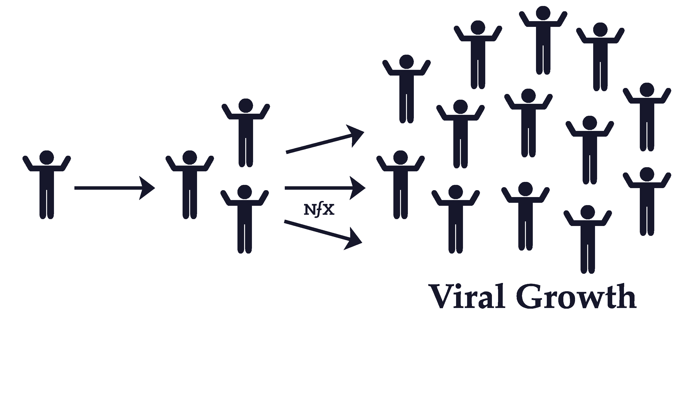

Viral effects are different than network effects, but many people confuse the two.

病毒效应不同于网络效应，但许多人都会把两者弄混。

Network effects add value to a product when more people use it. The more people use a product with network effects, the more utility each existing user gains from it, so the less likely they are to switch to a competitor. Network effects are about retention and defensibility.

当越来越多的人使用产品时，网络效应会增加产品的价值。使用具有网络效果的产品的人越多，每个现有用户从产品中获得的效用就越大，所以他们切换到竞争对手的可能性就越小。网络效应是关于留存和防御的。

Viral effects are about getting new users to use your product. A product is said to be viral when existing users bring you more users for free. A product or service with viral effects has a “viral coefficient”, which is the number of new users that join as a result of each user. For example, if an average Facebook user in the early days invited enough friends to get two of their friends to join in a certain amount of time, we would say that, at that time, Facebook had a viral coefficient of 2. This would mean exponential growth in the new users joining per day for free.

病毒效应的目的是让新用户使用你的产品。当现有用户免费为你带来更多的用户时，一个产品就可以说是病毒式的。具有病毒效应的产品或服务具有“病毒系数”，即每个用户带来的新用户数量。例如，如果一个普通的 Facebook 用户在早期邀请了足够多的朋友，让他们的两个朋友在一定的时间内加入，我们会说，当时 Facebook 的病毒系数是 2。这意味着每天免费加入的新用户将呈指数级增长。

The confusion between viral effects and network effects stems from the fact that 1) they are both positive feedback loops, and 2) they were experienced together in famous companies like Facebook, Twitter, and WhatsApp over the last 15 years.

病毒效应和网络效应之间的混淆源于这样一个事实：第一，它们都是正向反馈循环，第二，在过去的十五年里，它们经常一起出现在一些著名的公司里。比如Facebook、Twitter 和 WhatsApp 等。

However, since we ourselves have created viral effects in over ten companies that went viral enough to attract over 10 million users, we can attest that it is easier to craft viral effects on products than it is to build products with network effects. What’s more, products with networks built in naturally allow for more language to build viral hooks and loops — a subject we’ll expand on elsewhere.

不过，由于我们自己在十多家公司创造了病毒效应，足以吸引 1000 多万用户，我们可以证明，在产品上制造病毒效应要比制造具有网络效应的产品容易。更重要的是，内置网络的产品天然有更多的元素来构建病毒效应。

Many products can have viral effects without having network effects. Just because a product is viral doesn’t mean that every new user makes the product more valuable and defensible. Viral effects helped propel Facebook to its current position because Facebook *also* has a network effect. However, going viral didn’t make [JibJab](https://www.jibjab.com/), Buzzfeed, or the Sequoia-backed [QuizUp](http://www.businessinsider.com/quizup-relaunch-into-social-network-2015-5) (which raised $27M and died) nearly as defensible or valuable. Their success was flashy but short-lived.

许多产品可以在没有网络效应的情况下产生病毒效应。仅仅因为一个产品是病毒式的，并不意味着每个新用户都会使产品更有价值和更具防御性。病毒效应有助于推动Facebook达到目前的位置，因为 Facebook 也有网络效应。然而，病毒式传播并没有使 [JibJab](https://www.jibjab.com/)、Buzzfeed或红杉支持的 [QuizUp](http://www.businessinsider.com/quizup-relaunch-into-social-network-2015-5)（筹得 2700 万美元并倒闭）变得更具防御性或有价值。它们的成功只是昙花一现。

The reverse is also true. Products with network effects don’t necessarily have viral effects. A [B2B marketplace](https://www.nfx.com/post/24-ways-b2b-marketplace) could easily use paid advertising to attract buyers and sellers and build a 2-sided marketplace network effect with zero virality. A company could deploy thousands of IoT devices across a city creating a mesh network

反之亦然。具有网络效应的产品，不一定具有病毒效应。[B2B市场](https://www.nfx.com/post/24-ways-b2b-marketplace)可以很容易地使用付费广告来吸引买家和卖家，并建立一个没有病毒性的双边市场网络效应。一家公司可以在一个城市部署数以千计的物联网设备，创建一个网状网络。

For example, you could buy ads on Google to drive both sellers and buyers into a B2B marketplace and build a 2-sided marketplace network effect and still have zero virality. Or, you could pay a city to deploy a thousand IoT devices across a city that creates a mesh network whose performance — due to the network density — is so much better than any others that no competitor could hope to compete until they also deploy a thousand nodes to their own mesh network.

例如，你可以在谷歌上购买广告，将卖家和买家都推向 B2B 市场，并建立双边市场网络效应，但仍然没有病毒性。或者，你可以花钱，在一个城市中部署上千个物联网设备，创建网状网络，由于网络密度的原因，这些设备的性能比任何其他设备都要好得多，没有竞争对手能够匹敌，除非它们也在自己的网状网络中部署上千个节点。

Understanding the difference in network effects and viral effects is important for getting your playbooks right, especially considering how often people mix them up. Make sure that isn’t you. *Just because you have viral effects doesn’t mean you have nfx, and vice versa.*

了解网络效应和病毒效应的差异，对于正确制定策略很重要，特别是考虑到人们经常混淆它们。要记住，*仅仅因为你有病毒效应并不意味着你有网络效应，反之亦然。*

### “Platform Business Model” (Less helpful term)  “平台业务模式”（不太有用的术语）

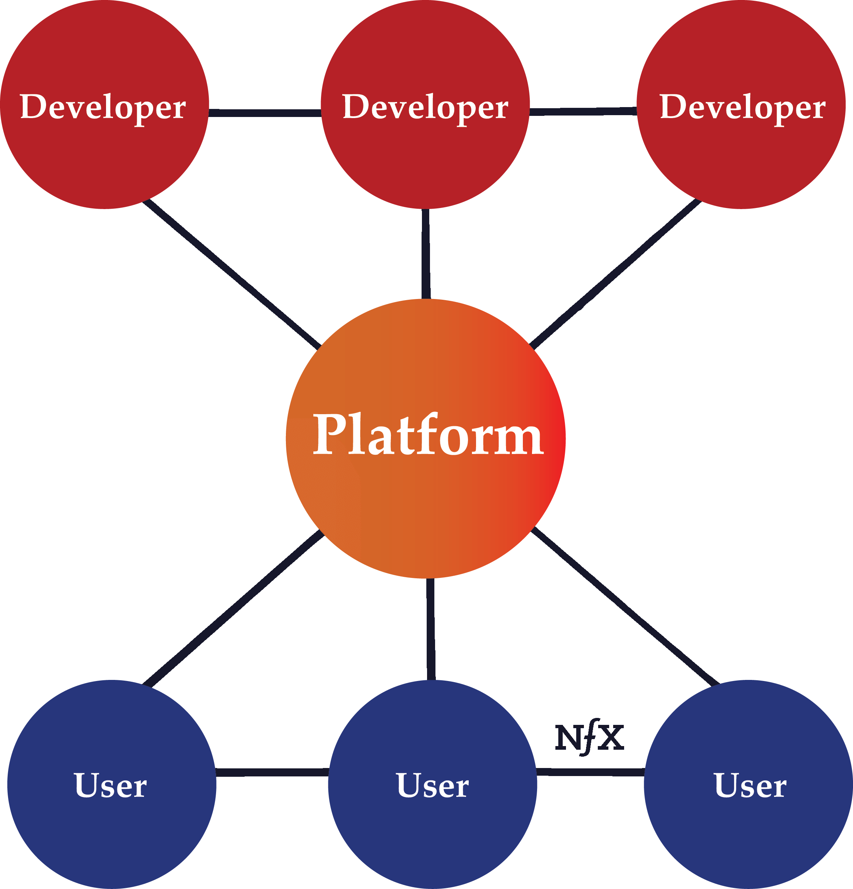

This is a recent term that is used to talk broadly about many types of companies with network effects that scale by cultivating external networks and facilitating the means of connection, not the means of production.  Those are important ideas. However, we feel the term conflates too many concepts to be very useful when trying to tease out the important elements of what make these businesses really work. We prefer to break out the 13 different network effects and the many attributes of networks.  We also reserve the term “platform” for network effect businesses like MS OS, iOS, or the FB Platform product where other Incorporated entities are building their businesses on them.

这是一个新近的术语，可以用来理解许多类型具有网络效应的公司，这些公司通过培育外部网络和促进连接手段而不是生产手段来扩大规模。这些都是很重要的想法。不过，我们觉得这个术语融合了太多的概念，在试图梳理这些公司真正运作的重要因素时，并不是很有用。我们更倾向于打破13种不同的网络效应和网络的许多属性。我们还保留网络效应业务的术语“平台”，如 MS OS、iOS 或其他注册实体在其上建立业务的平台产品。

### Reinforcement  强化

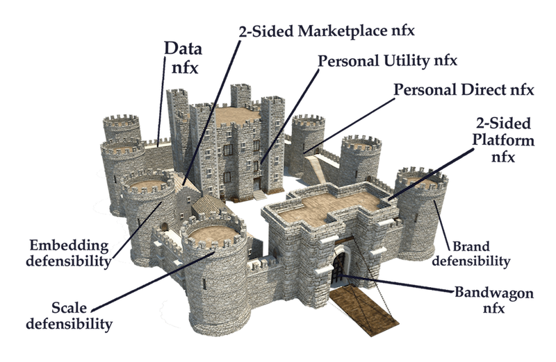

The important thing to know about network effects is that once you have one going, it’s much easier to build all the other defensibilities on top of it, including other network effects. This “reinforcement effect” is often underappreciated by Founders, especially when they’re preoccupied by growth. Continually looking for and launching new defensibilities is important because they reinforce each other: the more you have going the better they each work up (although this is only up until a certain point, because trying to do too much at once can detract from operational focus).

关于网络效应，最重要的一点是，一旦有了一个网络效应，在其基础上建立所有其他防御措施，包括其他网络效应，就会容易得多。创始人往往不重视这种 "强化效应"，尤其是当他们专注于增长时。不断寻找和推出新的防御措施非常重要，因为它们可以相互促进：你的防御措施越多，它们各自的效果就越好（不过，这也只是到了一定程度才会出现的情况，因为试图同时做太多事情会分散对业务的关注）。

### Scale Effects  规模效应

Scale, like network effects, is an important defensibility in the digital era. Scale effects are often confused with network effects because both scale effects and network effects become stronger with more users.

规模和网络效应一样，是数字时代的重要防御手段。规模效应常常与网络效应混淆，因为随着用户的增加，规模效应和网络效应都变得更强。

However, they work very differently. The best way to understand scale is that as well-run companies get bigger, their *per unit* production costs get cheaper. As a scale effect starts to kick in, the company with a scale advantage becomes the obvious mathematical choice for customers.

然而，它们的工作方式却截然不同。理解规模的最好方法是，随着经营良好的公司变得越来越大，它们的*单位生产成本*变得越来越便宜。随着规模效应开始发挥作用，具有规模优势的公司会成为客户最明显的数学选择。

In other words, more users means greater volume, which means cheaper prices from suppliers, which means lower prices for customers, which means higher conversion rates for ads, which makes advertising more effective than the competition, and so on and so forth.

换句话说，用户越多意味着数量越大，意味着供应商的价格越便宜，成本优势就越明显，意味着广告的转化率越高，使得广告比竞争对手更加有效，等等。

With scale, the numbers all begin to move in your favor and math is hard to compete with. This concept is known in the academic literature as “economies of scale.” In short, *per unit* production costs get cheaper. Amazon is the tech world’s leading scale effects company (and now they are adding network effects… watch out).

随着规模的扩大，你会变得很有优势。这一概念在学术文献中被称为“规模经济”。简言之，*单位生产成本*变得更便宜。亚马逊是科技界领先的规模效应公司（现在他们正在添加网络效应……小心）。

### Brand  品牌

Brand is a powerful defensibility, but it’s fundamentally different from network effects. Like with scale, your brand defensibility is correlated with the growth and usage of your product, and so it’s easy to confuse brand with network effects. However, they work very differently.

品牌是一种强大的防御力，但它与网络效应有着根本的不同。就像规模一样，你的品牌防御力与你产品的成长和使用相关，所以很容易混淆品牌和网络效应。

Brand arises when people know who you are and what you do. A well-established brand identity comes with *psychological* switching costs. People are less likely to switch to an unknown or lesser-known brand from yours because psychologically they will default toward what’s familiar.

当人们知道你是谁，知道你在做什么，品牌就会出现。一个成熟的品牌认同伴随着*心理*转换成本。人们不太可能从你的品牌转向未知或知名度较低的品牌，因为从心理上来说，他们会默认选择熟悉的品牌。

People tend to be risk averse and avoid the unknown. When you have brand recognition, people are familiar with what you are and what you do. That gives you a competitive edge. Brand defensibility is so critical in today’s attention economy that, paradoxically, even negative brand awareness can help make your business more defensible (within certain limits).

人们倾向于规避风险，避免未知。当你得到品牌认可时，人们会熟悉你是谁和你做什么。这给了你竞争优势。品牌防御性在当今注意力经济中非常重要，甚至负面的品牌意识也能帮助你的业务更具防御性（在一定限度内）。

### Embedding  内嵌

Embedding is accomplished by integrating your product directly into customer operations so the customer can’t rip you out and replace you with a competitor without incurring significant cost in time, energy, or both. In other words, embedding *directly heightens switching costs* as part of the process of user adoption.

内嵌是通过将你的产品直接集成到客户操作中来实现的，这样客户在不付出大量时间、精力或两者兼顾的情况下，是不可能替换掉你的产品的。换句话说，作为用户采用过程的一部分，内嵌*直接增加了转换成本*。

Embedding can work with network effects to make your business more defensible, but they are separate concepts.

内嵌可以与网络效果配合发挥作用，使你的业务更具防御性，但它们是独立的概念。

Examples of embedding include Workday, Oracle, or SAP — and as these examples show, embedding is more prevalent when customers are organizations, not individuals (it’s difficult to embed in personal life “operations”). That being said, embedding does exist for B2C products — think of Google drive or iCal.

内嵌的例子包括 Workday、Oracle 或 SAP，正如这些例子所示，当客户是组织而不是个人时，内嵌更普遍（很难内嵌到个人生活的“操作”中）。尽管如此，B2C 产品也确实存在内嵌——想想谷歌 drive 或 iCal 吧。