原文信息：

- 原文链接：[The Network Effects Manual: 16 Different Network Effects (and counting)](https://www.nfx.com/post/network-effects-manual)
- 作者：The NFX Team
- 更新时间：2021-06-25
- 翻译参考：[36 氪](https://36kr.com/p/1722331922433)

---
# The Network Effects Manual  网络效应手册

Twitter. Amazon. Apple. Meta. Uber. Salesforce. Tesla. These are some of the most impactful and significant companies in the world.

推特（Twitter）、亚马逊、苹果、Meta、Uber、赛富时（Salesforce）、特斯拉，这些都是世界上最有影响力和最重要的公司。[^1]

[^1]: Ponge 注：在更新的版本中，删掉了 PayPal、微软，加上了亚马逊、苹果、特斯拉。

Each one is very different in a lot of ways, but there’s a single property that defines them all and lies behind their success: Network effects.

这几家公司在很多方面都非常不一样，但是有一项属性定义了他们，并且是他们取得成功背后的基础。这个属性就是网络效应（Network Effects）。

Network effects [are the #1 way to create defensibility in the digital world](https://www.nfx.com/post/defensibility-most-value-for-founders). Companies with the strongest types of network effects built into their core business model tend to win, and win big.

网络效应是[在数字世界建立可防御性的头号手段](https://www.nfx.com/post/defensibility-most-value-for-founders)。在核心商业模式植入了最强类型网络效应的公司往往能够取胜，而且是大胜。

Our three-year study shows that [network effects are responsible for 70% of the value created by tech companies](https://www.nfx.com/post/70-percent-value-network-effects) since the Internet became a thing in 1994. Even though they are only a minority of companies, companies with network effects end up creating the lion’s share of the value.

我们3年的研究表明，自1994年互联网开始显山露水以来，[网络效应对技术公司价值创造的贡献率达到了70%](https://www.nfx.com/post/70-percent-value-network-effects)。尽管具备网络效应的公司只是少数，但是却创造力大部分的价值。

We believe in network effects so strongly that they inspired the name for our firm: NFX.  For Founders looking to build truly impactful companies, few areas of expertise are more valuable.

我们对网络效应深信不疑，因此我们公司的名称就来源于网络效应：NFX。对于寻求建立真正具备影响力公司的创始人来说，几乎没有比这更有价值的领域知识了。[^2]

[^2]: Ponge 注：新增了第一句，说明了 NFX 公司名称的含义。

Still, misconceptions abound. Many people talk about network effects, but few understand the hidden complexities: what they really are, how they work, the many different types, and how to build and maintain them. Moreover, very few companies want to share their valuable playbooks around network effects, so most founders don’t even recognize different types of network effects when they see them, much less understand their complex inner workings.

时至今日，误解仍然比比皆是[^3]。很多人都在谈论网络效应，但很少有人了解其中隐藏的复杂性：比如网络效应究竟是什么，网络效应的机制时什么样的，有多少种类型，以及如何建立和维护网络效应等。此外，很少有公司愿意跟别人分享自己在网络效应方面宝贵的操作手册，所以大多数创始人在看到网络效应时也无法认识不同的网络效应类型，更谈不上理解其复杂的内部机制了。

[^3]: Ponge 注：删除了「网络效应方面的文章很少」相关表述。随着这几年网络效应被人讨论的越来越多，这种说法显然不合时宜了。

Here we present our network effects map and accompanying manual. It’s an ever-evolving effort, and we’re continually making changes and updates. So far we’ve identified 16 types of network effects, each with their own playbook. This manual is intended to be a starting point for discussion around network effects (we’ll shorten it to nfx, for speed). In addition to reading this manual, we encourage you to check out these companion resources:

在此，我们向大家展示我们的「网络效应地图」和配套手册。这是一项不断更新的成果，我们也在持续地进行修改和更新。到目前为止，我们已经确定了 16 种网络效应类型，每种类型都有自己的操作手册。本手册旨在作为围绕网络效应展开讨论的起点。除阅读本手册外，我们还建议您查看以下配套资源：

-   [The Network Effects Masterclass](https://www.nfx.com/masterclass), a 3-hour course bringing together all of our learnings on network effects from over 20 years of research and investing.  [网络效应大师课](https://www.nfx.com/masterclass)：这是一个 3 小时的课程，汇集了我们 20 多年来在网络效应方面的研究和投资心得。
-   [The NFX Bible](https://www.nfx.com/post/network-effects-bible), which describes the most important network effects concepts and terms.  [网络效应圣经](https://www.nfx.com/post/network-effects-bible)：其中介绍了最重要的网络效应概念和术语。
-   [The NFX Archives](https://www.nfx.com/post/network-effects-archives), a compendium of the most insightful articles even written about network effects and network science.  [NFX 档案馆](https://www.nfx.com/post/network-effects-archives)：汇集了有关网络效应和网络科学的最有见地的文章。

## Network Effects Basics  网络效应基础

As you probably know, the simplified definition of network effects is that they occur when a company’s product or service becomes more valuable as usage increases.

你大概已经了解，网络效应的简化定义是：当公司的产品或者服务会随着使用增加而变得更有价值时，就发生了网络效应。

By this definition, network effects seem deceptively straightforward. But when you take a closer look, you start to notice that different types of networks are very different in how they behave. As a result, not all nfx are created equal — some are stronger and tend to produce more value than others.

按照这一定义，网络效应似乎简单明了。不过这是有欺骗性的，如果你仔细看看的话，你就会注意到不同类型的网络效应在行为方式上存在很大的不同。因此，并不是所有的网络效应都是一样的——其中一些会更强，而且往往会创造出更高的价值。

Network effects are one of the [four remaining defensibilities](https://www.nfx.com/post/defensibility-most-value-for-founders) in the digital age, including brand, embedding, and scale. Of the four, network effects are by far the strongest. To date, **we’ve identified 16 distinct types of nfx that fall under five broader categories.**

在数字时代，网络效应是仅剩的[四大防御能力](https://www.nfx.com/post/defensibility-most-value-for-founders)之一，其他三个分别是品牌（Brand）、植入（Embedding）以及规模（Scale）。在这四种能力当中，网络效应是目前为止防御性最强的一种。迄今为止，我们共发现了**16 种网络效应类型，可分为 5 个大类**。

In the map below, we’ve depicted the various nfx types (labeled) and categories (organized by color), with the strongest and simplest network effects at the center of the map. The other three defensibilities are also shown on the right.

在下面这幅地图中，我们描绘了各种网络效应类型（已标记）和分类（按颜色组织），其中最强也是最简单的网络效应在图片中央。另外三种防御性也列到了图右。

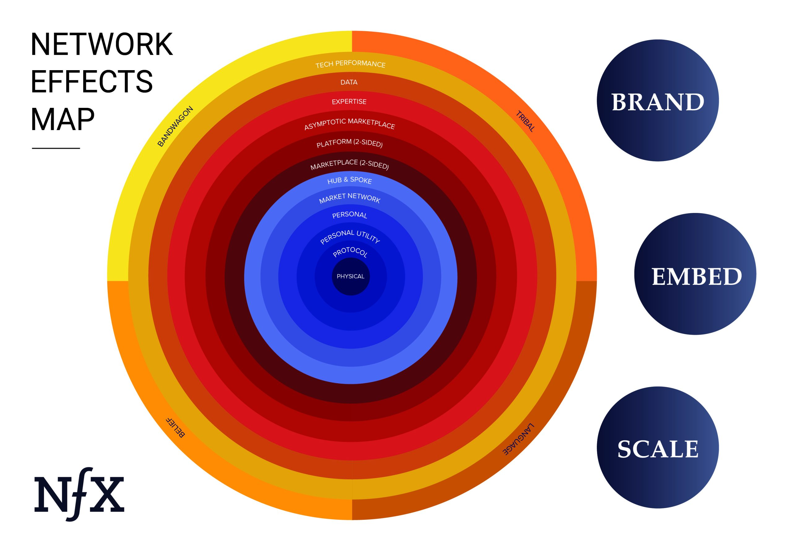

We developed this map as an exercise over the years to help bring greater clarity to the subject. But before we dive in, there are a few things we should point out:

多年来，我们不断更新这幅地图，以帮助我们更清晰地了解这一主题。但在我们深入探讨之前，有几件事我们需要指出：

1.  The map we’ve laid out here isn’t meant to be taken as an incontrovertible truth — it’s a beginning point for discussion and understanding. It’s one of our evolving methods to help Founders recognize and make use of powerful forces to build great companies. Because for Founders looking to build a strong competitive moat, the ability to identify and understand nfx is invaluable.  我们在此绘制的地图并不意味着是无可争议的真理——这只是讨论和理解的起点。这是我们不断完善的方法论，希望借此来帮助创始人认识和利用强大的力量，来建立伟大的公司。因为对于寻求建立牢固的竞争护城河的创始人来说，识别和理解网络效应的能力是无价的。
2.  Network effects are **not** viral effects. Network effects are about creating defensibility, and viral effects are about getting new users for free. They have totally different objectives and playbooks.  网络效应**不等同于**病毒效应（Viral Effects）。网络效应是建立防御性，病毒效应是为了免费获得新用户。这两个的目标完全不一样，操作手册也完全不同。
3.  You’ll often see the same companies have several nfx at play simultaneously, meaning that the different nfx types are not mutually exclusive. They are like colors, and your company is like a work of art. It helps to be familiar with the full palette as you paint.  你经常会看到同一家公司同时出现了多种网络效应，这意味着不同的网络效应类型并不是互斥的。他们就像颜色一样，而你的公司就像是一件艺术品。所以你在画画的时候熟悉这个调色盘是很有帮助的。

With that said, let’s turn to the Map itself. Below each of the various nfx on the Network Effects Map are described, with relevant examples.

所以接下来我们就讲讲这幅地图本身。以下就是网络效应地图的各种网络效应，以及相关的例子介绍。

## Direct Network Effects  直接网络效应

The 1st broad category of nfx, shown in blue on the Network Effects Map, are direct network effects. The strongest, simplest network effects are direct: increased usage of a product leads to a direct increase in the value of that product to its users.

在网络效应地图中蓝色系的第一大类是直接网络效应（direct network effects）。这是最强也是最简单的一种网络效应：增加某产品使用可直接提升产品对用户的价值。

The direct network effect was the first ever to be noticed, back in 1908. The Chairman of AT&T at the time, Theodore Vail, noticed how hard it was for other phone companies to compete with AT&T once they had more customers in a given locale. He pointed this out in his [annual report to shareholders](http://www.beatriceco.com/bti/porticus/bell/pdf/1908ATTar_Complete.pdf), writing that:

直接网络效应第一次受人关注要追溯到 1908 年。当时 AT&T 的主席 Theodore Vail 注意到，一旦自己在特定地区有了更多客户之后，其他的电话公司想要跟自己竞争就变得困难许多了。他在向股东提交的[年度报告](http://www.beatriceco.com/bti/porticus/bell/pdf/1908ATTar_Complete.pdf)中指出了这一点：

> “Two exchange systems in the same community, cannot be… a permanency. No one has use for two telephone connections if he can reach all with whom he desires connection through one.”  在同一个社区出现两套电话交换系统是不会之久的。一旦通过一套系统就可以联系到所有想联系的人，没人会想要两条电话线路。

Vail noticed that the value of AT&T was mostly based on their network, not their phone technology. At the time, it was a revolutionary insight. It showed that even if a new telephone was clearly superior to their old phone on a technical level, no one would want the new telephone if they couldn’t use it to call their friends and family.

Vail 注意到 AT&T 的价值主要基于他们的网络，而不是他们的电话技术。那时候，这是一个革命性的洞察。它说明，哪怕新的电话技术上比旧电话要更加出色，也没人想要新电话，因为用户联系不到自己的家人朋友。

In other words, a better product wouldn’t come close to making up the lost value of the network. A new entrant would have to achieve a comparable network effect to realistically produce a comparable amount of value for its users. In Vail’s words:

换句话说，更好的产品并不足以弥补网络损失掉的价值。新的进入者必须实现科比的网络效应才能有效地为用户产生科比的价值。用 Vail 的话来说：

> “A telephone — without a connection at the other end of the line — is not even a toy or a scientific instrument. It is one of the most useless things in the world. Its value depends on the connection with the other telephone— and increases with the number of connections.”  如果在另一头没有连接的话，电话甚至连玩具或者科学仪器都算不上。没有连接的电话就是这个世界上最没用的东西之一。电话的价值取决于跟其他电话的连接——以及连接数的增加。

Below are the full texts of the relevant pages of that 1908 annual report. You’ll notice that Vail never uses the phrase “network effects”, although that’s the concept he’s describing. The term itself would only emerge later.

下面就是 1908 年那份年度报告的相关页面。你会注意到， Vail 从未使用过「网络效应」一词，尽管这正是他所描述的概念。网络效应这个词是后面才出现的。

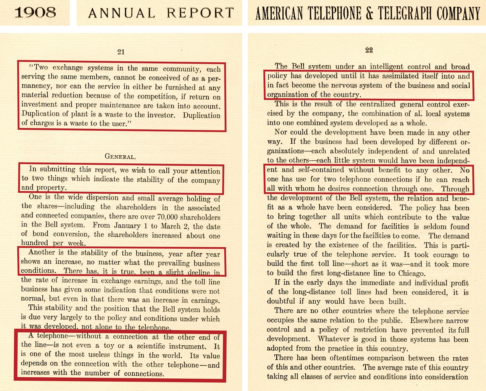
*Excerpts from the AT&T 1908 Annual Report AT&T 1908年度报告摘编*

72 years after Vail first described direct network effects, the father of the Ethernet standard, Robert Metcalfe, took the concept a step further by proposing that the value of a network is proportional to the number of connected users squared (N^2). This is now known as Metcalfe’s Law.

在 Vail 首次描述直接网络效应 72 年之后，以太网标准之父 Robert Metcalfe（梅特卡夫）进一步深化了这个概念，他提出网络的价值与连接用户数的平方（N^2）成正比关系。这就是现在众所周知的梅特卡夫定律。

The diagram below illustrates the basic concept of a direct network as described by Metcalfe’s Law:

下图说明了梅特卡夫定律描述的直接网络效应的基本概念：

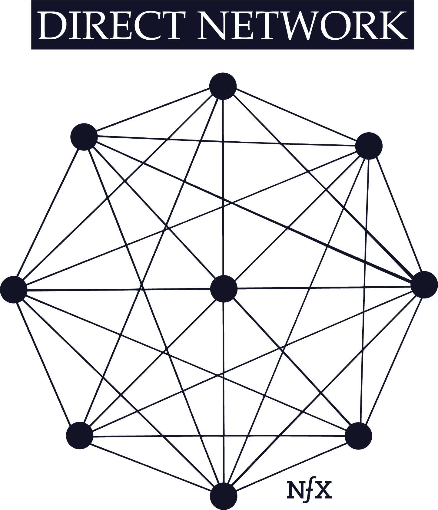
*Each node in a digital network is connected to every other node, as represented by the diagram above. Every additional node that joins a direct network adds a new connection for all the existing nodes, so the number of new connections (network density) increases as a square of the number of nodes (N2). Since the value of a network is proportional to its density, each additional node adds to the network value at a geometric rate.  如上图所示，数字网络的每一个节点都与其他的每一个节点互连。每一个新加入网络的节点都会增加与所有已有节点的新连接，所以新增连接数（网络密度）相当于节点数的平方（N2）。由于网络的价值与其密度成正比关系，每一个新增节点都会让网络价值以几何速率增长。*

In 2001, an MIT computer scientist named David Reed went even further, declaring that Metcalfe’s law actually *understated* the value of a network. He pointed out that within a larger network, smaller, tighter networks can form: for example, the football team within a high school network; siblings within a family network; tennis players within a co-worker network.

2001 年，MIT 计算机科学家 David Reed 又进一步深化了这个概念，他宣称梅特卡夫其实*低估了*网络的价值。他指出，在较大的网络中可以形成小一点、更紧密一点的网络：比方说，高中网络中的橄榄球队；家庭网络内的兄弟姐妹们；同事网络中的一起打网球的人。

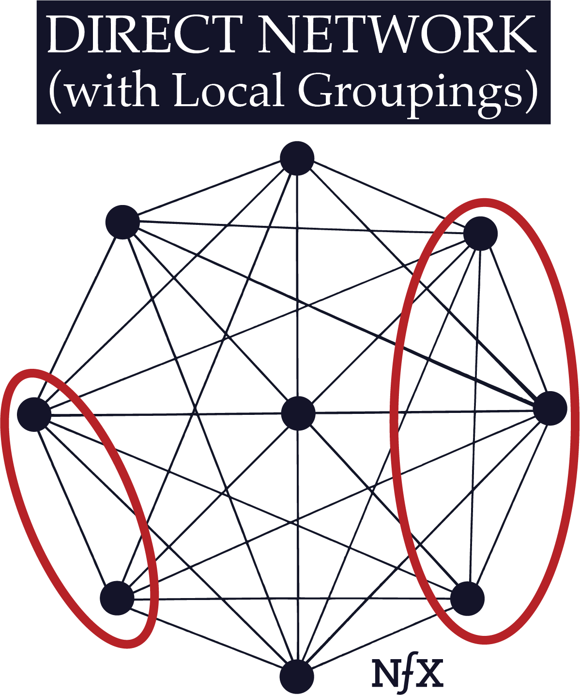

Such connections, and the potential to join other subgroups, cement people’s commitment to the overall network in deeper ways that the overall size and connection density of the network would imply by themselves. Because of this, Reed believed that the true value of a network increases exponentially (2^N) in proportion to the number of users, much faster even than what Metcalfe’s Law described. We now call this [Reed’s Law](https://en.wikipedia.org/wiki/Reed's_law).

这种连接，以及加入其他子群的可能性，以更深层次的方式巩固了人们对整个网络的依附，而网络的整体规模和连接密度本身并不意味着这种粘性。因此，Reed认为网络的真正价值随联网人数呈指数级（2^N）增加，这个速度要远远快于梅特卡夫定律的描述。我们现在称之为[里德定律](https://en.wikipedia.org/wiki/Reed's_law)。

The details of these laws can be debated academically, but for Founders, they provide a tangible way to conceptualize an operational truism — nfx are powerful. They are a law of nature.

这些定律的细节在学术上还可以进行争论，但对于创始人来说，这些手册提供了一种具体的方式来理解一个商业真理——网络效应是强大的。这是一种自然规律。

Within the broader category of direct nfx, there are many different types. So far, we’ve identified five: physical, protocol, personal utility, personal, and market network.

而在直接网络效应这个大类里面，又可以分成很多类型。目前为止，我们发现了5种：物理直连网络效应、协议网络效应、在线通讯网络效应、社交产品网络效应以及个体市场网络效应。[^4]

[^4]: Ponge 注：这里应该是忘记更新了。实际上目前应该是六种，新增了一种中心辐射网络效应。

### Physical (Direct)  物理直连网络效应

Physical Direct nfx are direct network effects tied to physical nodes (e.g. telephones or cable boxes) and physical links (e.g. wires in the ground). This is the most defensible network effect type because it not only has a direct network effect, but it also lends itself to the addition of other defensibilities; namely, scale effects and embedding. Competing with a company that has Physical Network Effects requires a large upfront investment of capital and physical constraints.

物理直连网络效应（Physical Direct nfx）是与物理节点（比如电话或分线盒）和物理链路（如地下的线路）相关联的直接网络效应。这属于防御性最强的网络效应，因为它不仅具备直接网络效应，而且也有助于增加其他的防御性；比如规模效应和植入。与具有物理直连网络效应的公司竞争，需要大量的前期资本投入和物理限制。

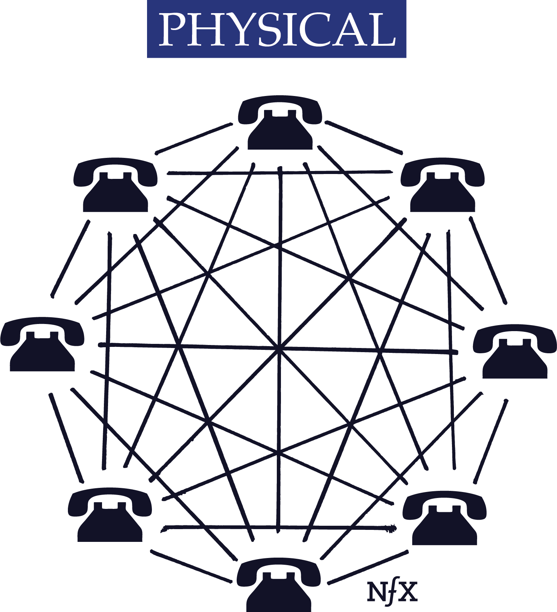

*The diagram above depicts the shape of a physical network, with the nodes representing utility terminals like landline phones, train stations, or water faucets, and the connections between nodes representing physical like landlines, train tracks, or water pipes.  上图描绘了一个物理网络的形状，其中节点表示类似固话、火车站或者水龙头这样的实用终端，而节点间的连接则代表类似电话线、火车轨道或者水管这样的实体。*

Roads, trains, electricity, sewage, natural gas, cable and broadband internet are examples of businesses with physical direct network effects. In fact, most Physical Networks are utilities: winner-take-all markets that develop into monopolies and end up being nationalized.

道路、火车、电力、下水道、天然气、有线和宽带互联网都是具备直接网络效应的业务例子。实际上，大多数的物理网络都是公用事业：都属于赢家通吃的市场，会形成垄断，最后被国有化。

The best evidence for the strong defensibility of Physical Networks is that so many of them have poor or substandard services, and yet continue to lead the market. Think of Comcast and Verizon. Why do they have the [lowest customer satisfaction](http://fortune.com/2017/05/25/cable-tv-comcast-verizon/) in the US? Because they can get away with it at no risk to their bottom line. No one can compete with them. Who could spend the money to lay all that cable? And with no competitors, frustrated customers have nowhere to turn.

物理网络的防御性很强，这方面最好的证据是其中那么多服务都很糟糕或者不合格，但仍然能保持领先位置。不妨想想 Comcast 和 Verizon。为什么它们的[客户满意度在美国最低](http://fortune.com/2017/05/25/cable-tv-comcast-verizon/)？因为就算满意度最低他们的财务收入也不会有问题。没人能够跟他们竞争。谁愿意投钱去铺设那么大的网络呢？在没有竞争对手的情况下，沮丧的客户也没有别的地方可去。

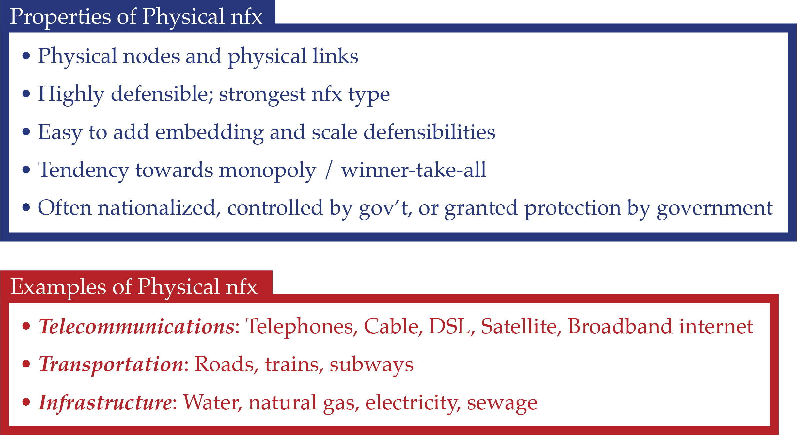

Properties of Physical nfx 

物理直连网络效应的特点

- Physical nodes and physical links  物理节点和物理链路
- Highly defensible; strongest nfx type  高度防御性，最强网络效应类型
- Easy to add embedding and scale defensibilities  容易增加规模效应和植入的防御能力
- Tendency towards monopoly / winner-take-all  容易走向垄断/赢家通吃
- Often nationalized, controlled by gov't, or granted protection by government  往往被国有化，被政府控制，或者政府授权保护

Examples of Physical nfx 

物理直连网络效应的实例

- Telecommunications: Telephones, Cable, DSL, Satellite, Broadband internet  电信：电话、有线、DSL、卫星、宽带互联网
- Transportation: Roads, trains, subways  交通：道路、火车、地铁
- Infrastructure: Water, natural gas, electricity, sewage  基础设施：自来水、天然气、电力、污水处理

### Protocol (Direct)  协议网络效应

A Protocol Network Effect arises when a communications or computational standard is declared and all nodes and node creators can plug into the network using that protocol. Bitcoin and Ethereum are recent examples of protocol networks. The protocol setter can be either an individual company, a group of companies, or a panel.

当一种通信或者计算标准公布后，所有节点创建者均可利用该协议接入该网络，这时候就产生了协议网络效应（Protocol Network Effect）。比特币和以太坊就是协议网络的近期例子。协议制定者可以是一家公司，一批公司，或者一个小组。

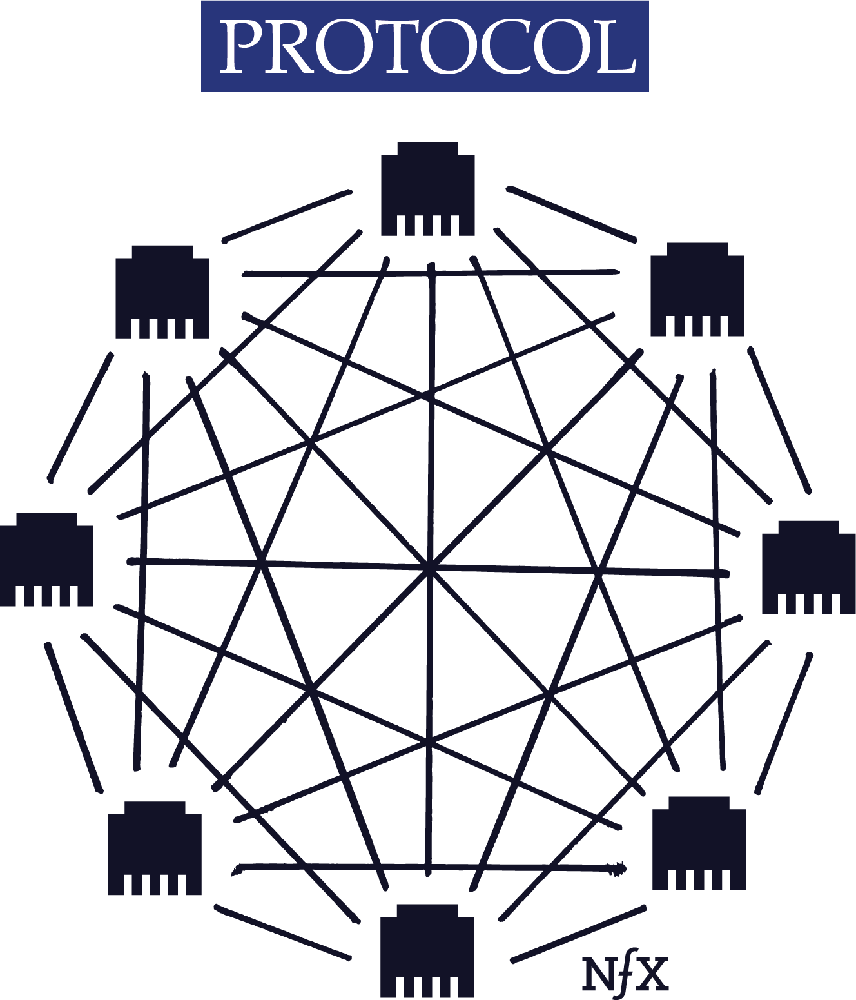
*Protocol networks coalesce around communication and computational standards, which form the basis for the links between nodes (e.g. Bitcoin miners and Bitcoin wallets).  协议网络以通信和计算标准为核心，构成节点（如比特币矿工和比特币钱包）之间联系的基础。*

Ethernet is another, more traditional, example of a Protocol Network Effect. When Robert Metcalfe founded 3Com, he persuaded DEC, Intel, and Xerox to adopt Ethernet as a standard protocol for local computer networks, with a standard speed of 10 megabits per second, 48-bit addresses, and a global 16-bit Ethertype-type field. Competing proprietary protocols existed, but as Ethernet pulled away and began to capture more and more market share, Ethernet-compatible products flooded the market. This increased the value of Ethernet at a compounding rate and decreased the value of competitors, regardless of their relative performance. Soon, ethernet ports became standard features of all modern computers.

以太网是另一个更传统的协议网络效应的例子。Robert Metcalfe 成立 3Com 的时候，他说服了 DEC、英特尔以及施乐采用以太网作为局域网的标准协议，该协议规定了每秒 10 兆比特的标准速率、48 位的地址以及一个全局性的 16 位以太网类型字段。当时市面上也有竞争的专有协议，但随着以太网的发展并开始占据越来越多的市场份额，与以太网兼容的产品充斥市场。这使得以太网的价值以复合速度增长，同时降低了竞争对手的价值，无论其性能如何。很快，以太网端口成为所有现代计算机的标准配置。

Once a protocol has been adopted it is extremely difficult to replace. Note how the fax protocol is still in use, or the TCP/IP protocol (even though other, better protocols now exist for those purposes).

一种协议一旦被采用就很难被取代了。不妨留意一下，为什么直到今天我们还在使用传真协议或者 TCP/IP 协议（尽管有针对相关目的的更好协议存在）。

It’s also true that the protocol creator doesn’t typically capture most of the value from the development of the network, as they normally do with other direct nfx.

另外需要注意的是，与其他直接网络效应不同，协议创建者通常无法获取网络发展所带来的大部分价值。

This distribution of value in a Protocol Network can be shifted if the protocol creator can maintain ownership of a significant percentage of the tokens within a token-enabled network, or maintain central control over addressing, identity, wallets, naming, or prioritization and still get the network to adopt the protocol.

如果协议创造者能够在代币化网络内保留相当一部分比例的代币所有权，或者保留对地址、身份、钱包、命名或优先级控制权进行集中控制，同时仍然能让网络采用该协议的话，那么协议网络中的这种价值分配就可以改变。

The success of such an adoption strategy is often less about technology and more about marketing, social engineering, and choice of market niche. That’s why VHS beat Betamax, even though Betamax was arguably a better standard. It’s also part of why Bitcoin has taken off as a digital store of value, when it is costly to operate and less transactional than many other digital currencies.

这样一种采用策略的成功往往跟技术关系不太大，更多与营销、社会工程以及市场定位有关。所以 VHS（译者注：日本公司开发的录像机录制和播放标准）才会击败 Betamax，尽管 Betamax 无疑是更好的标准。这也是为什么比特币作为一种数字价值储藏已经开始流行的部分原因，尽管比特币的运营成本很高，交易量也比许多其他数字货币少。

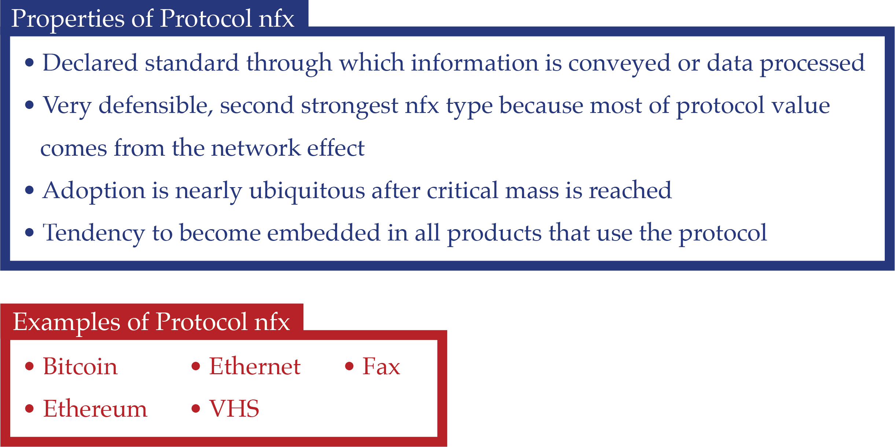

Properties of Protocol nfx

协议网络效应的特点

- Declared standard through which information is conveyed or data processed  信息传送或数据处理的标准 
- Very defensible, second strongest nfx type because most of protocol value comes from the network effect  防御性很强，排名第二位的网络效应类型，因为大多数协议价值来自于网络效应
- Adoption is nearly ubiquitous after critical mass is reached  突破临界点后会被广泛采用
- Tendency to become embedded in all products that use the protocol  往往被嵌入到使用该协议的所有产品里面

Examples of Protocol nfx

协议网络效应的实例

- Bitcoin  比特币
- Ethernet  以太网
- Fax  传真
- Ethereum  以太坊
- VHS  VHS 标准的录像机和录影带

### Personal Utility (Direct)  在线通讯网络效应

Personal Utility Networks have two distinguishing qualities. The first is that users’ personal identities are tied to the network in question, often with usernames tied to their real name as with Facebook Messenger. The second is that they are essential to the personal or professional lives of users on a daily basis.

在线通讯网络（Personal Utility Networks）[^5]具有两个明显的特征。第一个是用户的个人身份跟网络是捆绑的，用户名往往与真实姓名相关联，就像Facebook Messenger一样。其次是用户个人生活或职业生活基本上每天都离不开这种网络。

[^5]: Ponge 注：直译应该是「个人效用网络」，但一般中文语境里说「个人效用」也很难明白这是什么。这段整体论述的都是通讯工具带来的网络效应，因此意译为「在线通讯网络」

*In the diagram above, the nodes are represented by the chat bubbles of people (nodes) connected by personal utility services (links). The nodes of a personal utility network are tied to the real-life identity of the people using it, and the network is especially dense because it has many local sub-groupings. This brings Reed’s Law into effect, so the value of Personal Utility Networks could increase at a rate of up to 2^N.  在上图中，节点代表的是在线通讯网络服务（链接）连接的大家之间的聊天气泡（节点）。在线通讯网络的节点跟使用者的真实身份是绑定在一起的，这种网络尤其密集，因为有很多的局部子群。这样就使得Reed定律发挥作用了，所以在线通讯网络的价值增长率也是2^N。*

People use Personal Utility Networks to communicate and interact with their own personal networks, so not being online or being part of the network has a steep downside. Opting out would become a significant impediment in daily life and could greatly harm people’s important personal or work relationships.

大家使用在线通讯网络来与自己的个人关系网络进行沟通与交互，因此不在线或者不成为该网络的一部分就非常不利了。选择退出会对日常生活造成明显妨碍，甚至极大伤害到其重要的个人或工作关系。

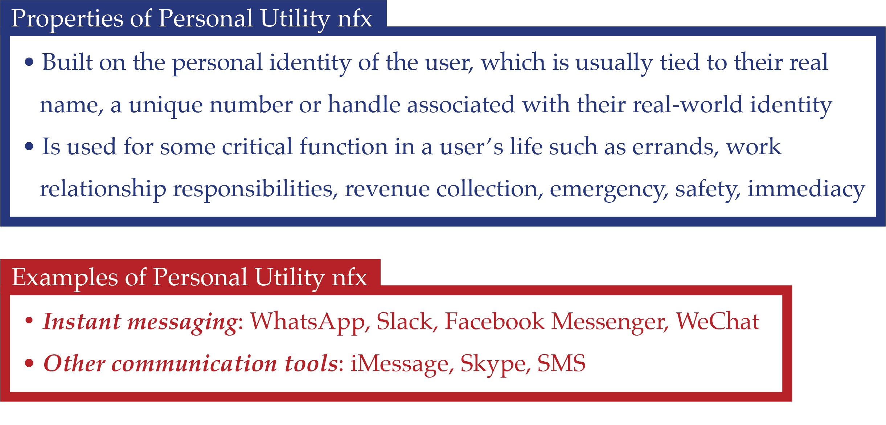

Properties of Personal Utility nfx

在线通讯网络的特点

- Built on the personal identity of the user, which is usually tied to their real name, a unique number or handle associated with their real-world identity  基于用户的个人身份，这通常与他们的真实姓名、身份证号与其现实世界身份相关的标识符关联在一起。
- Is used for some critical function in a user's life such as errands, work relationship responsibilities, revenue collection, emergency, safety, immediacy  用于用户生活中的一些关键功能，包括日常事务、工作关系管理、收入管理、应急处理、安全保障以及即时通讯等。

Examples of Personal Utility nfx

在线通讯网络的实例

- Instant messaging: WhatsApp, Slack, Facebook Messenger, WeChat  即时通信：Whatsapp、Slack、Facebook Messenger、微信
- Other communication tools: iMessage, Skype, SMS  其他沟通工具：iMessage、Skype、短信

### Personal (Direct)  社交产品网络效应

Personal nfx are in play when a person’s identity or reputation is tied to a product. Often people on a Personal Network are influenced to join by people they might know in real life. If people you know from the real world are all using the same product to house their identity and reputation, there’s a large value add (to you) if you join the network yourself.

当个人身份或者名声跟产品绑定在一起时，就会产生社交产品网络效应（Personal nfx）。社交产品网络上的人往往容易受到自己在现实生活中认识的人影响而加入。如果你在现实世界中认识的人都使用同一款产品管理自己的身份与名誉的话，如果你自己也加入这个网络，你也会增值不少。

*Personal Networks involve personal identity and reputation, connecting the persona of each user with other user personas. Each additional node represents both an additional potential audience member as well as an additional content producer for all the other nodes.  社交产品网络牵涉到个人身份与名誉，它把每一位用户的角色与其他用户的角色连接起来。每增加一个节点都代表着潜在受众成员的增加，对于所有其他节点来说也代表着内容制造者的增加。*

Personal Networks differ from Personal Utility Networks in two main ways. As explained in the previous section, Personal Utility Networks are typically used for things that need to get done. There is a substantial amount of *practical* utility to the user. Second, Personal Utility Networks are typically more for private communication, rather than public communication. Personal Networks are less vital. You can stop using them and your life won’t alter that much. Networks like Facebook or Twitter or Linkedin (when you’re not job hunting) aren’t usually essential for your day-to-day life.

社交产品网络与在线通讯网络的不同主要有两个方面。就像上一节解释那样，在线通讯网络通常用于需要完成的事情。对用户而言，在线通讯网络具有相当大的*实用性*。其次，在线通讯网络往往更多是私下沟通，而不是公开沟通。社交产品网络的作用就没那么关键了。你不用它生活也不会改变多少。像 Facebook、Twitter 或者LinkedIn（不在找工作的时候）通常通常对你的日常生活并不重要。  

However, Personal Networks are still very strong. You aren’t running to join another friend network or professional network now that you have FB and LinkedIn. It’s also true you could stop using both and be fine on a daily basis.

然而，社交产品网络仍然非常强大。有了 FB 和 LinkedIn 以后，你就不必再加入其他好友社交产品网络或职业社交产品网络了。当然，你也可以停止使用这两个服务，也不会影响你的日常生活。

There’s a difference between sending an IM to your significant other telling them to not miss picking up your Mom at the airport and posting a status update about your Mom visiting on social media. In both cases, your own identity is tied to the communication and your audience is your personal connections. But one is a private need-to-have and the other is a public nice-to-have.

给你的另一半发即时消息提醒他们不要忘记去机场接你妈妈，这与在社交媒体上发布一条关于你妈妈来访的状态更新是有区别的。这两种情况下，你的个人身份都与通信相关联，而且你的受众都是你的个人社交圈。然而，前者是私密且必要的沟通，而后者则是公开的、可有可无的分享。

The Personal Network Effect arises from the interpersonal, tribal impulse to build connections with others. It’s this impulse that compels people to join and stick with a network (e.g. Facebook, LinkedIn, or a religion) because their friends/co-workers/neighbors are also part of that network. A user’s “social graph” in a personal network are usually closely mapped to their in-the-flesh relationships.

社交产品网络效应源于人际间的合群冲动，这种冲动促使人们与他人建立联系。正是这种冲动促使人们加入并留在一个网络（例如 Facebook、LinkedIn 或宗教），因为他们的朋友、同事或邻居也在这个网络中。用户在社交产品网络中的「社交图谱」通常与他们现实生活中的关系紧密相关。

Properties of Personal nfx

社交产品网络的特点

- Your personal identity and reputation is at stake  你的个人身份和名声利害攸关  
- Often serves as an extension of existing relationships from your real life  往往充当现实生活关系的延伸
- Very difficult to leave since it's tied to your most important IRL relationships  由于它与你最重要的现实生活关系紧密相连，因此难以脱离
- Enables you to create and maintain a public image  让你可以建立和维持公众形象

Examples of Personal nfx

社交产品网络的实例

- Social: Facebook, Instagram, Google+, Pinterest, Tumblr  生活社交类应用：Facebook, Instagram, Google+, Pinterest, Tumblr
- Professional: LinkedIn, GitHub, Twitter \[depends on usage\]  职业社交类应用：LinkedIn, GitHub, Twitter（取决于具体需求）

### Market Networks (Direct)  个体市场网络效应

A Market Network combines the identity and communication aspects of a Personal Network with the transactions focus and purpose that typify a marketplace. Usually, Market Networks start by enhancing a network of professionals that already exists offline. We consider Market Networks to be a form of direct network effects because the relationship between nodes is direct, as shown below:

个体市场网络（Market Networks）结合了社交产品网络的身份和通信特性，以及典型交易市场的特点（关注交易行为，以交易为目的）。通常，线下的职业人脉网络先前已存在，个体市场网络在此基础上开始形成。我们认为个体市场网络是一种直接网络效应的形式，因为节点之间的关系是直接的，如下所示：

Market Networks are very different from 2-Sided Marketplaces, although the two are often confused. Most people think companies like HoneyBook and Houzz are marketplaces, but they’re not. In reality, they’re Market Networks, which combine the main elements of both Personal Direct Networks *and* 2-Sided Marketplaces, as well as being *many*-sided as opposed to 2-sided — often with the addition of a dedicated SaaS workflow software. For a detailed description of Market Networks, see [our article on the subject](https://www.nfx.com/post/10-years-about-market-networks).

个体市场网络与双边市场有很大的不同，尽管两者经常被混淆。大多数人认为像 HoneyBook 和 Houzz 这样的公司属于交易平台，但其实不是。实际上，它们是个体市场网络，结合了社交产品网络*与*双边市场的主要元素，而且是*多边*而不是双边。这种网络通常还配有专用的 SaaS 工作流软件。有关个体市场网络的详细介绍，请参阅[我们的相关文章](https://www.nfx.com/post/10-years-about-market-networks)。

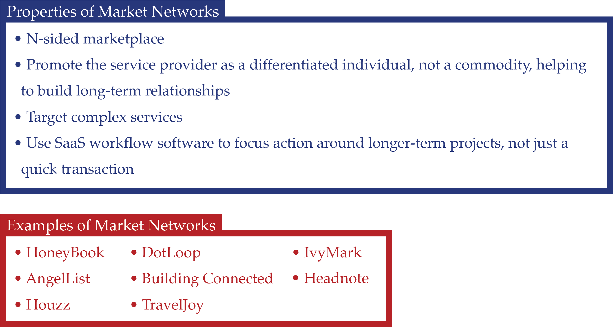

Properties of Market Networks

个体市场网络的特点

- N-sided marketplace  多边交易市场
- Promote the service provider as a differentiated individual, not a commodity, helping to build long-term relationships  卖家为具有独特性的个体，而非无差别的卖家，有助于建立双方长期关系
- Target complex services  针对复杂服务
- Use SaaS workflow software to focus action around longer-term projects, not just a quick transaction  使用 SaaS 工作流软件来关注长期项目，而不仅仅是快速交易

Examples of Market Networks

个体市场网络的实例

- HoneyBook
- DotLoop
- IvyMark
- AngelList
- Building Connected
- Headnote
- Houzz
- TravelJoy

### Hub-and-Spoke  中心辐射网络效应

A Hub-and-Spoke network effect occurs when equal nodes submit content or goods to a central Hub. Then the Hub "pushes" a chosen few pieces out to all – or nearly all – of the nodes.

当相同的节点向中心枢纽（Hub）提交内容或商品时，就会产生中心辐射网络效应（Hub-and-Spoke network effect）。然后，中心「推送」所选的少量内容给所有（或几乎所有）节点。

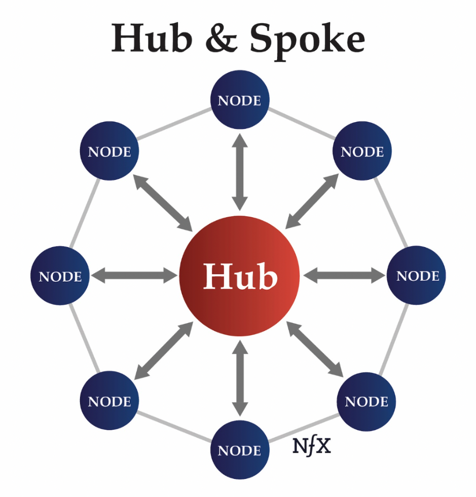

That elevation of the pushed content drives tremendous attention and value to those few lucky nodes, asymmetrically benefiting them relative to others in the network. In other words, it directs a power law within the system.

这种被推送的内容为那些少数幸运的节点带来了巨大的关注和价值，相对于网络中的其他节点，他们获得了不成比例的收益。换句话说，它在系统内部形成了幂律分布（一种少数节点占据大部分资源的分布模式）。

To a node, that process of selection feels like a lottery, and the benefits of selection are sudden and extreme compared to other direct networks like FB, Twitter, Snap. Because of that potential positive impact, nodes are incentivized to work hard to produce something of extreme quality hoping to be noticed, thereby adding a lot of value to the network in a short amount of time.

对于一个节点来说，这种选择过程就像抽奖一样，而被选中的好处相比其他直接网络（如 Facebook、Twitter、Snap）来说是突然且极端的。由于这种潜在的积极影响，节点被激励创作极高质量的内容，希望被注意到，从而在短时间内为网络增加大量价值。

To the Hub, that selection is an algorithmic internal process.

对于中心来说，这种选择是一个算法内部过程。

As shown above, the network structure looks like a hub and spoke, thus the name. But unlike an old hub-and spoke-network like a TV or radio broadcasting network, which grows in value only by [Sarnoff’s Law](https://www.nfx.com/post/network-effects-bible#:~:text=same%20network%20simultaneously.-,Sarnoff%E2%80%99s%20Law,-David%20Sarnoff%20was), this network grows with the power of [Metcalf’s Law](https://www.nfx.com/post/network-effects-bible#:~:text=Metcalfe%27s%20Law%20states%20the%20value,of%20users%20on%20the%20network) because it 1) harnesses the many nodes to create the content/products rather than take that burden itself, and 2) allows the nodes to connect with each other like a typical social network, driving more interactions and value.

如上所示，中心辐射网络结构看起来像一个星型的轮毂和辐条（hub and spoke），因此得名。但与旧的轮毂和辐条网络（如电视或广播网络）不同，旧网络的价值仅按萨诺夫定律（Sarnoff’s Law）（价值与用户数成正比）增长，这种中心辐射网络的价值增长则遵循梅特卡夫定律（Metcalf’s Law）（价值与用户数的平方成正比），因为它 1) 利用众多节点创造内容/产品，而不是自己承担这个负担，2) 允许节点像典型的社交网络一样相互连接，促进更多的互动和价值创造。

## 2-Sided Network Effects  双边网络效应

The 2nd broad category of nfx, 2-sided nfx, are often called “indirect network effects” in academic literature. However, we think this is misleading since 2-sided networks can involve both direct *and* indirect network effects.

网络效应的第二大类是双边网络效应（2-sided nfx），在学术文献中往往又被称为「间接网络效应（indirect network effects）」。然而，我们认为这属于一种误导，因为双边网络*既可包含*直接网络效应*也可包括*间接网络效应。

Instead, the real distinguishing characteristic of a 2-sided network is that there are two different classes of users: supply-side and demand-side users. They each come to the network for different reasons, and they produce complementary value for the other side.

相反，双面网络真正显著的特点是存在两类不同的用户：供应侧（supply-side）和需求侧（demand-side）用户。他们出于不同的原因加入网络，并且为对方提供了互补性的价值。

It’s relatively simple to see how each new supply-side user in a 2-sided network directly increases the value of the network for demand-side users, and vice versa. For instance, each new seller (supply-side user) on a 2-sided marketplace like eBay directly adds value for buyers (demand-side users) by increasing the supply and variety of goods. Likewise, every additional buyer is a new potential customer for sellers.

双边网络中某一侧用户数量的增加可以直接增加对面用户的价值，这一点比较容易理解。供应侧的用户多了，需求侧用户的体验会提升，反之亦然。举例来说，像 eBay 这样的双边市场，每一个新卖家（供应方用户）都会通过增加商品供应和种类直接为买家（需求方用户）增加价值。同样，每增加一个买家，对卖家来说也都多了一个潜在客户。

It’s more complicated when we look at how same-side users interact. Most of the time, users on the same side *subtract* value directly from each other. For instance, core sellers on eBay create more competition for other sellers. More Uber passengers at rush hour mean surge pricing. Both are examples of negative direct same-side nfx.

不过同一侧用户的互动就要复杂一些。大多数时候，同一侧的用户会相互直接*扣减*对方价值。比方说，eBay 上的核心卖家对其他卖家构成了更大的竞争威胁。高峰时间的 Uber 乘客增多意味着价格激增。这些都是同侧网络效应产生的直接负面影响（negative direct same-side nfx）。

At the same time, *indirect* benefits usually end up outweighing those direct negatives. The fact that there are many sellers in the marketplace attracts the buyers to be there in the first place. And that is ultimately more valuable for the sellers, even if they have to sell at more efficient prices. The same is typically true on the buyer side.

不过与此同时，*间接*正面影响通常会超过那些直接负面影响。事实上，市场的卖家众多会在第一时间吸引买家。而这对卖家来说最终会带来更大的价值，即便他们必须用更便宜的价格去卖东西。类似地，对买家来说往往也是一样。

This positive indirect effect of 2-sided networks has been discovered and rediscovered throughout history. In the late 1600s, for instance, all the violin makers moved to work and sell their violins on the same street in Venice. Although the proximity of the competing violin vendors drove down prices, it was worth it for the suppliers as a group because it was more important for them that people in the market for violins would take their business to that particular street, not some other street in some other city.

双边网络的这种间接正面影响（positive indirect effect）在历史上被多次发现和重新认识。例如，在 17 世纪晚期，所有的小提琴制造商都迁移到威尼斯的同一条街道上制作和销售他们的小提琴。尽管竞争对手凑到一起导致价格下降，但对于整个供应商群体来说这是值得的。因为对他们而言，更为重要的是确保想要购买小提琴的顾客会来到这条特定的街道，而不是去其他城市的其他街道。

In the 1980s, malls in the US discovered the same thing. By aggregating competing sellers in one location, sellers were able to get much more business than others that were spread out, making it practical for competitors to co-locate.

1980 年代，美国的商场也发现了这一点。通过将相互竞争的卖家集中到一个地方，这里的卖家就能比位置分散的其他卖家做成更多的生意，这使得竞争者合用同一地点成为现实。

What we’re seeing now with the preponderance of online 2-Sided Networks is the same effect, but with software instead of a physical location.

我们在线上双边网络也看到了同样的效应，只不过是通过软件而不是物理位置。

Note also that there are cases of *positive direct* same-side nfx, where more same-side users add value to each other. These are very powerful and should be sought out as you design your products. This is the case with Microsoft OS, one of the most enduring 2-sided nfx products the world has seen. Microsoft OS users benefit other users because they can share files more easily with co-workers and friends. This is a positive direct same-side network effect (adding to the core 2-sided network effect) that is typical of operating systems.

还需注意，存在同侧网络效应产生的*直接正面影响*（positive direct same-side network effects）的情况，即更多同侧用户能为彼此增加价值。这些效应非常强大，在设计产品时应该积极追求。微软操作系统就是一个典型例子，它是世界上最持久的双边网络效应产品之一。微软操作系统用户之间能够相互受益，因为他们可以更轻松地与同事和朋友共享文件。这种正向直接同侧网络效应（增强了核心双边网络效应）是操作系统的典型特征。

At present, we’ve identified three types of 2-sided network effects: marketplace, platform, and asymptotic.

目前，我们发现了 3 种类型的双边网络效应：双边交易平台网络效应（marketplace）、（系统/应用）双边平台网络效应（platform）、边际价值递减型双边交易平台网络效应（asymptotic）。[^6]

[^6]: Ponge 注：和直接网络效应那里是同样的问题，就是原文没有更新，应该是 4 种类型，还有一种是专业技能（Expertise）。

### Marketplace (2-Sided)  双边交易平台网络效应

The two sides of a marketplace are buyers and sellers. Successful 2-Sided Marketplaces like Craigslist are very difficult to disrupt. To break them apart you must have a better value proposition for both parties **simultaneously**, or else nobody moves. Customers are there for the vendors, and vendors are there for the customers. One won’t leave without the other.

市场的双边是买家和卖家。像 Craigslist 这样成功的双边市场是很难被颠覆的。要想拆散他们你得**同时**对双方有更好的价值主张，否则的话没人会走的。对于供应商来说客户就在那里，而对于客户来说供应商就在那里。如果对方不走的话没人会走的。

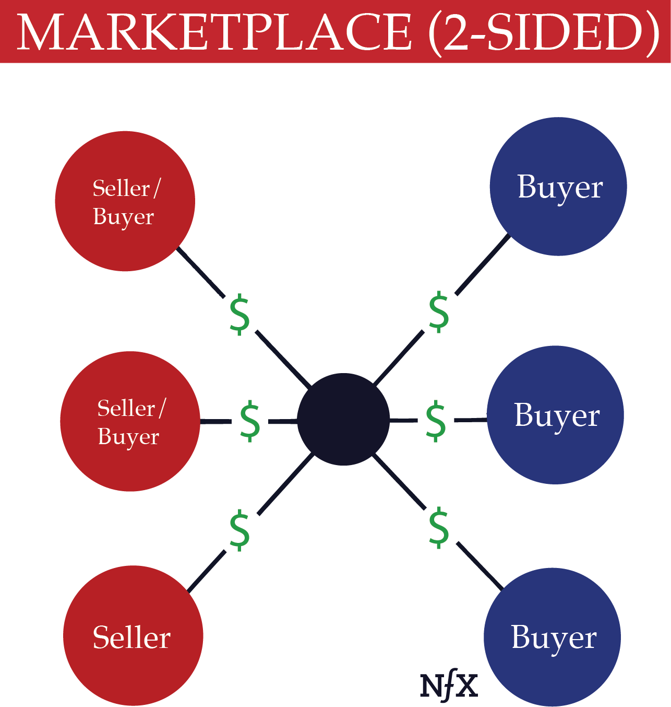
*2-Sided Marketplaces have two sets of nodes, as shown above. One set supply-side users, the other demand-side users. They provide direct value each other through the marketplace, which is an intermediary represented by the central node in the diagram.  如上图所示，双边市场有两组节点。一组是供应侧用户，另一组是需求侧用户。他们通过市场（中间人，在图中以中心节点的形式体现）相互提供直接价值。*

With a 2-Sided Marketplace, the network is what provides the majority of the value, not the app or website itself — which explains why marketplaces products like eBay and Craigslist can afford to look essentially unchanged after 16 years.

在双边市场里面，提供绝大部分价值的是网络，不是 app 或者网站本身——这就解释了为什么像 eBay 和 Craigslist 这样的市场产品可以长达 16 年看起来都不怎么变过的原因。 

But there’s one big weakness in marketplace defensibility, which arises from the phenomenon of “multi-tenanting”. People can sell their products on eBay and Etsy at the same time. Landlords can list their apartments on Craigslist and Trulia, and renters can check both marketplaces to browse for inventory. It’s hard to lock out competition from new entrants when the members of your network can use competing networks as well as yours without a penalty. The goal of the marketplace is thus to design the product/service to add so much value or “lock-in”, particularly on the supply side, that members won’t be tempted to multi-tenant.

不过交易平台（marketplace）在防御性上却有着一大弱点，这是由于所谓的“多租户”现象引起的。大家可以同时在 eBay 和 Etsy 上卖自己的产品。房东可以同时在 Craigslist 和 Trulia 上面出租自己的公寓，租客可以同时到这些市场上面浏览详细目录。当你的网络成员同时可以使用竞争网络而不受惩罚时，你很难把新进入者关在门外。因此市场的目标就是设计产品/服务增加大量价值或者「客户锁定」，尤其是对供应侧的价值增加和锁定，这样成员才不会想采取多租户的做法。

Further, marketplaces come in more shapes than we might think. Media companies, for example, are essentially 2-Sided Marketplaces. Audiences (supply) come to the marketplace and sell their attention for content experiences. Advertisers (demand) on the other side buy the attention of the audiences. The greater the audience of a media company, the more likely advertisers will be to spend any money on that media company at all, and then the more money they will be willing to pay the company when they do. “Sellers” i.e. readers/viewers have a direct positive network effect for “buyers”, i.e. advertisers. And vice versa, because (in theory) more advertising revenue gives a media company the resources to produce better content.

此外，交易平台的形态也比我们想象的要丰富。比方说，媒体公司本质上属于双边市场。受众（供应）来到这个市场售卖他们的注意力换取内容体验。广告商商（需求）来到市场的另一侧为的是购买受众的注意力。媒体公司的受众越多，广告商就越有可能在那家媒体公司身上花钱，并且愿意花的钱也越多。「卖家」（如读者/浏览者）对「买家」（如广告商）有着直接的正面的网络效应。反之亦然，因为（理论上）广告收入越多，媒体公司就有资源制作更好的内容。

Properties of 2-Sided Marketplace nfx

交易平台的特点

- Two sides: buyers and sellers   双边：买家与卖家
- The more opposite-side users, the better (direct nfx)  对方用户越多越好（直接网络效应）
- Same-side nfx actually tend to have negative direct nfx  同一侧的网络效应趋于负面直接网络效应
- The positive from indirect same-side nfx outweighs the negative direct nfx  不过对同侧的间接的正面网络效应往往压倒了直接的负面网络效应
- Highly defensible, but vulnerable to multi-tenanting  防御性很高、但易受多租户影响

Examples of 2-Sided Marketplaces

交易平台的实例

- eCommerce: eBay, Alibaba, Amazon Marketplace, Etsy 电子商务：eBay、阿里巴巴、亚马逊、Etsy
- Media: Wikipedia, Medium, Facebook, Google 媒体：维基百科、Medium、Facebook、Google
- Matchmaking: Craigslist, Tinder, Trulia, OpenTable 撮合匹配：Craigslist、Tinder、Trulia、OpenTable
- Payment: Visa, American Express, Discover 支付：Visa、美国运通、Discover

### Platform (2-Sided)  （系统/应用）双边平台网络效应

What we call 2-Sided Platform nfx are similar to 2-Sided Marketplace nfx, in that they have two sides with very different interests that directly benefit each other. The difference is that the supply side actually engineers products that are only available on the platform. The supply side has to do work to integrate to the platform. The products created and sold by the suppliers are a function of the platform, not independent of it.

我们所说的（系统/应用）双边平台网络效应（2-Sided Platform nfx）其实类似于双边交易平台网络效应，它们都有两个利益截然不同的群体，这两个群体能够直接互惠。不同之处在于，这里的供给方实际上设计的产品只在该平台上可用。供给方必须付出努力与平台进行整合。供应商创造和销售的产品是平台的产物，而非独立于平台之外的东西。

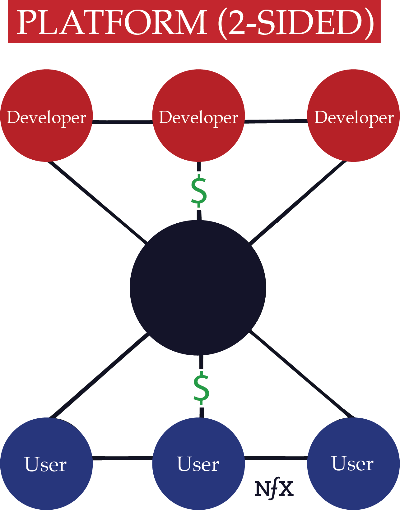
*2-sided platforms have supply-side nodes (developers) and demand-side nodes (users), which create value for each other through the intermediary of the platform itself (central node). The platform itself also provides significant value for both sides. 双边平台有供应侧节点（开发者）和需求侧节点（用户），彼此都通过平台本身（中心节点）为对方创造了价值。平台自己也为双方提供了显著的价值。* 

Microsoft OS, iOS, and Android are prime examples of products that have achieved this type of nfx. Xbox, PlayStation, and Wii are also examples, although they’re slightly different.

微软操作系统、iOS 和 Android 都是实现了这种网络效应的突出例子。Xbox、PlayStation 以及 Wii 也属于这种类型，只不过略有不同。  

Another difference platforms have from marketplace nfx is that, compared to online marketplaces, the features and benefits of the platform itself can play a greater role in the utility of a platform relative to the network. People buy iPhones and thus iOS for the brand, design, technical features, and performance of the phone as much as they do for the app ecosystem. People might buy Xbox and PlayStation consoles for the graphics and performance of the system as much as they do for the library of available games. This in contrast with marketplaces, where the product itself comes in at a very distant second compared to the value of the network.

（系统/应用）平台网络效应跟交易平台网络效应还有一个不同，那就是相对于在线交易平台，平台本身的特性和优势在其效用方面可能发挥更大作用，而不仅仅依赖于网络效应。人们购买 iPhone 和 iOS 系统，不仅是为了其应用生态系统，也看重其品牌、设计、技术特性和性能。同样，人们购买 Xbox 和 PlayStation 游戏机，可能既是为了系统的图形处理能力和性能，也是为了其丰富的游戏库。这与交易平台形成了鲜明对比。在交易平台中，交易平台本身的价值远远不如网络所带来的价值。

How a platform is sold can also matter a great deal to how well adopted it becomes by both sides. For instance, Microsoft has an army of salespeople who sell their platform to large corporate clients, and they often give the platform away for free to universities so graduates learn to standardize on that platform.

平台的推广方式对其在双方使用者中的采用程度有很大影响。例如，微软拥有一支庞大的销售团队，他们将平台销售给大型企业客户，并且他们经常免费将平台提供给大学，以便毕业生学习并培养在该平台上的使用习惯。

One vulnerable point for platforms is that, just like with marketplaces, both sides of platforms can also multi-tenant. App developers can create versions of their app for both iOS and Android. Game developers can syndicate their games to PlayStation as well as Xbox. Likewise with the other side — gamers can own a PS4 and an Xbox One simultaneously, and people can own both a Dell and a Macbook. However, the pricing makes this more prohibitive than with online marketplaces, where multi-tenanting is usually free. So from that standpoint, platforms often have a leg up.

不过（系统/应用）平台有一个薄弱环节，就像交易平台一样，平台的双方也可以采用多租户模式（即同时使用多个平台）。应用开发者可以为 iOS 和 Android 同时开发他们应用的版本。游戏开发者可以将他们的游戏同时发布到 PlayStation 和 Xbox 上。同样，用户方面也是如此——游戏玩家可以同时拥有 PS4 和 Xbox One，人们可以同时使用 Dell 和 Macbook 电脑。然而，与在线交易平台的多租户通常是免费的不同，（系统/应用）平台的多租户使用往往因价格因素而受到限制。因此从这个角度来看，（系统/应用）平台通常在用户黏性方面具有优势。

Properties of 2-Sided Platform nfx

（系统/应用）双边平台的特点

- Two sides: users and developers 双边：用户和开发者
- Positive indirect nfx, as with marketplaces 网络效应存在间接正面影响，和交易平台一样
- Product and sales method matters more than with online marketplaces 跟在线交易平台相比，产品和销售方法更重要
- Multi-tenanting is also a challenge with platforms 多租户也是（系统/应用）平台的挑战

Examples of 2-Sided Platforms

（系统/应用）双边平台的实例

- Desktop operating systems: Microsoft OS, Mac OS, Linux 桌面操作系统：微软操作系统、Mac OS、Linux
- Mobile operating systems: Android, iOS 移动操作系统：Android、iOS
- Gaming consoles: Sony, Nintendo, Xbox 游戏主机：索尼、任天堂、Xbox
- Enterprise: Salesforce Lightning 企业服务：Salesforce Lightning
- Other attempts: Facebook Platform, Twilio 其他：Facebook 应用平台、Twilio

### Asymptotic Marketplace (2-Sided) 边际价值递减型双边交易平台网络效应

Of course, no two 2-Sided Marketplaces are exactly the same. One way they can significantly differ is in the “value curve.” This refers to how **fast** the value to the demand side increases as supply increases, and how **strong** the nfx get when critical mass is reached.

当然，没有两个双边市场是完全相同的。它们可能存在显著差异的一个方面是「价值曲线（value curve）」。这个概念指的是两个关键因素：一是随着供给的增加，需求方获得的价值增长有多**快**；二是当达到临界规模（critical mass）时，网络效应变得有多**强**。

The “Value Curve” diagram below illustrates the supply and demand curves for three subcategories of marketplace nfx..

下面这张「价值曲线」图说明了交易平台网络效应三个子类别的供需曲线情况。

The straight line (orange) in the middle is what you would expect with Craigslist or eBay, where generally, the growth of the supply side produces value to the demand-side at a relatively proportional rate. Marketplaces like this get very strong over time.

中间的直线（橙色）就是 Craigslist 或者 eBay 这种交易平台的情况，一般来说，供应方的增长会以相对成比例的速度为需求方创造价值。随着时间的推移，这样的市场会变得非常强大。

The lower curve (yellow) is what you saw with OpenTable, where the value is delayed. OpenTable had to grow the supply-side of restaurants to a very high level before there was any value to the demand-side. Once that critical mass was achieved, however, the network effect became very powerful.

较低的曲线（黄色）就是 OpenTable 的情况，也就是价值是延迟的。OpenTable 必须在需求方产生任何价值之前，将餐厅的供应方发展到一个非常高的水平。然而，一旦达到临界规模，网络效应就会变得非常强大。

The third subcategory of marketplace nfx, illustrated by the red curve on the graph above, is what we call Asymptotic Marketplace nfx. It has the inverse properties of OpenTable’s delayed value curve. The initial supply quickly adds value to the demand side, but soon the value of increased supply starts to diminish.

上图中红色曲线所示的是交易平台网络效应的第三个子类别，我们称之为边际价值递减型交易平台网络效应（Asymptotic Marketplace nfx）。它的特性与 OpenTable 的延迟价值曲线恰好相反。在这种类型中，初始供给能快速为需求方创造价值，但随后随着供给的增加，价值增长开始明显放缓。

The most famous examples of an Asymptotic Marketplace are ridesharing companies like Uber and Lyft, as we wrote about in [this Uber case study](https://www.nfx.com/post/the-network-effects-map-nfx-case-study-uber). Up to a point, more drivers benefit riders because of reduced wait times. But beyond a certain point, the value to the rider steeply diminishes. Waiting 4 minutes for a ride as opposed to 8 minutes is a huge difference. But 2 minutes instead of 4 minutes? The value of increased supply diminishes drastically around the 4-minute mark.

边际价值递减型交易平台最著名的例子就是 Uber 和 Lyft 这样的共享出行公司，我们在 [Uber 案例研究](https://www.nfx.com/post/the-network-effects-map-nfx-case-study-uber)中对此进行了介绍。在一定程度上，更多的司机会让乘客受益，因为等待时间缩短了。但超过一定程度后，司机数量的增多对乘客来说就没有什么增值效果了。等 4 分钟打到车跟等 8 分钟才打到车是有很大差别的。但是等 2 分钟跟等 4 分钟呢？在 4 分钟左右，增加供应的价值就会急剧下降。

Asymptotic Marketplaces are more vulnerable to competition than other marketplaces for this reason. If Uber has 1000 drivers in a certain area, a competitor might be able to provide comparable service with half as many.

因此，边际价值递减型交易平台对于其他类型的交易平台更容易受到竞争的威胁。如果 Uber 在特定地区有 1000 位司机，那么竞争对手可能只需要一半的司机就能提供类似的服务。

Adding to this vulnerability, Asymptotic Marketplaces can be very susceptible to multi-tenanting. Many people use both Lyft and Uber to get around, depending on which one has lower pricing and faster waits at any given time. On the supply side, many drivers use both Uber and Lyft, depending on pricing and wait times.

除了这个弱点外，边际价值递减型交易平台也很容易受到多租户的影响。很多人都同时用 Lyft 和 Uber 打车，至于用哪一个要看特定时间谁的价格更低、等待时间更短。在供给侧，很多司机也是同时使用 Uber 和 Lyft，其考虑因素同样是定价和等待时间。

Properties of Asymptotic Marketplace nfx

边际价值递减型交易平台的特点

- Easy to achieve critical mass on the supply side 供应侧容易到达临界规模
- Steeply diminishing returns of increased supply early on 供应侧很快就会出现收益递减
- Vulnerable to new entrants 容易受新进入者影响
- Susceptible to multi-tenanting 易受多租户影响

Examples of Asymptotic Marketplaces

边际价值递减型交易平台的实例

- Lyft
- Uber

### Expertise  专业技能

Products that can develop “expertise” network effects are typically tools used by professionals to do their job — the instruments with which they ply their craft. As professionals become more skilled in their jobs, they also level up their expertise in tools required to do their jobs. If the tools are sophisticated enough, the tools require particular expertise of their own.

能够产生「专业技能（Expertise）」网络效应的产品，通常是专业人士用来完成工作的工具——即他们用来施展专业技能的工具。随着专业人员的工作技能不断提高，他们在工作中所需工具的专业度也在不断提升。如果这些工具足够复杂，那么掌握这些工具本身就需要特定的专业知识。

Employers often require proficiency in such tools when hiring, and so professionals have a strong incentive to develop expertise in tools with wide adoption that they can list on their resume and use as selling points on the labor market.

雇主在招聘时通常要求应聘者熟练掌握这些工具。因此，专业人士有强烈动机去掌握被广泛采用的工具，以便在简历上列出并在就业市场上作为自己的优势。

Companies likewise become more likely to employ the tools with the widest adoption by professionals because a) they want their employees to be able to interface to other companies in the industry, and b) they want to be able to attract the top talent who likely will want to use the most popular tool, and c) they know they can more easily replace the professional with someone else trained on the most popular tool.

同样，公司也更倾向于使用被专业人士广泛采用的工具，原因有三：

a) 他们希望员工能与行业内其他公司顺畅协作；  

b) 他们希望能够吸引顶尖人才，而这些人才很可能希望使用最流行的工具；

c) 他们知道可以更容易地用其他熟悉最流行工具的人替换现有专业人士。

And this is where the network effects kick in — for every new person in the labor market that develops expertise in a given product, the more valuable that product becomes to all players using or integrating that tool; i.e. all the other skilled users of the product (see the Appendix at the end of the article for a more detailed explanation of the mechanics of this network effect).

这正是网络效应发挥作用的地方。就业市场上每多一个掌握某产品专业技能的人，该产品对所有使用或整合该工具的参与者就变得更有价值。换言之，这种价值增加适用于该产品的所有熟练用户（关于这种网络效应机制的更详细解释，请参见本节末尾的附录）。

Here are some examples of industries and products where you see strong expertise nfx:

以下是一些具有强大专业技能网络效应的行业和产品例子：

-   Accounting Software (Quickbooks) 会计软件（Quickbooks）
-   CRMs (Salesforce, Hubspot) 客户关系管理软件（Salesforce、Hubspot）
-   Analytics (Google Analytics, MixPanel) 分析软件（Google Analytics、MixPanel）
-   Computer Languages (Python, React) 计算机语言（Python、React）
-   Spreadsheets (Microsoft Excel) 电子表格（Microsoft Excel）
-   Architecture (Revit, Autocad) 建筑（Revit、Autocad）
-   CMS platforms (WordPress) 内容管理系统平台（WordPress）
-   Design software (Adobe, Figma, Invision) 设计软件（Adobe、Figma、Invision）
-   Video editing (Adobe, Final Cut, Avid) 视频编辑（Adobe、Final Cut、Avid）
-   Mechanical Engineering (SolidWorks, CAD, Avid) 机械工程（SolidWorks、CAD、Avid）

[Read the full essay here](https://www.nfx.com/post/14th-network-effect-expertise/)

关于这个网络效应的详细解释，[点击这里阅读相关文章](https://www.nfx.com/post/14th-network-effect-expertise/)。

## Data Network Effects  数据网络效应

When a product’s value increases with more data, and when additional usage of that product yields data, then you have a Data Network Effect. This is the 3rd broad category of nfx.

当产品的价值随数据增多而提升，并且当产品的使用增多会产生数据时，就有了数据网络效应。这是第三大类的网络效应。

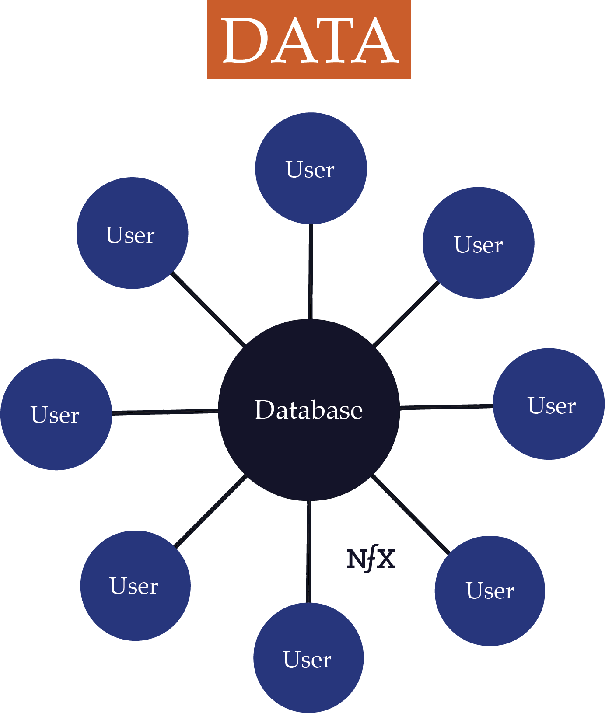
*With a data network, each node (user) feeds useful data to the central database. As the aggregated data accretes, the value of the data for each user also grows.  数据网络内每个节点（用户）都为中心数据库提供有用的数据。随着聚合数据的不断增长，数据对每一位用户的价值也随之提高。*

Data nfx tend to be weaker than many people — particularly venture capitalists — often want to believe: having more data doesn’t necessarily translate to value, and gathering more useful data isn’t always easy even if data is central to the product.

数据网络效应往往比很多人（尤其是风投家）认为的要弱：拥有更多数据未必就能转化为价值，而收集到更多的有用数据也不是一直都是易事，哪怕数据是产品的核心。  

Data can increase product value in different ways. If data is really central to the way the product benefits users, then the data nfx of that product has the potential to be very powerful. If data is only marginal to the product, the data nfx won’t matter much. When Netflix recommends a show to you, the algorithm is basing that recommendation on user viewing data. But Netflix’s discovery function is marginal; its real value comes from the inventory of tv shows, movies and documentaries. So Netflix only has a marginal Data Network Effect.

数据可以用不同的方式增加产品价值。如果数据的确是产品给用户带来好处的关键，则该产品的数据网络效应有可能就非常强大。如果数据只是产品的边缘属性，则数据网络效应就不太重要了。当 Netflix 向你推荐节目时，算法推荐的基础是用户的历史观看数据。不过 Netflix 的发现功能只是边缘性的功能；去真正价值来自于它的电视、电源及纪录片节目库存。所以 Netflix 仅存在很少的数据网络效应。

Likewise, the relationship between product usage and the amount of useful new data gathered can be asymmetrical. Yelp has a Data Network Effect because a greater number of reviews for a greater number of restaurants makes the product more valuable. But its network effect is weakened by the fact that only a small percentage of users produce the data; most people read from the Yelp database but don’t write to it.

同样，产品使用与收集到的有用新数据量之间的关系也可能是不均衡的。Yelp 具有数据网络效应，因为更多餐馆的更多评论使产品更有价值。但其网络效应因只有少数用户产生数据而减弱；大多数人只是阅读 Yelp 数据库中的内容，而不是向其中添加内容。

At the same time, Yelp is also a good example of a common weakness in Data nfx. Its Data nfx are asymptotic. The 5th review adds a lot more value than the 30th. Past a certain low level, more reviews on a restaurant don’t increase the value to you, the user. (Breadth of reviews, on the other hand, is very helpful and leads to solid nfx, which is why Yelp is still so prevalent.)

同时，Yelp 也是数据网络效应中常见弱点的一个很好的例子。它的数据网络效应是边际价值递减的（asymptotic）。第五条评论比第三十条评论增加的价值要大得多。在达到某个较低的水平后，更多的评论对用户的价值不会增加多少。（另一方面，评论的广度非常有帮助，并且会带来稳固的网络效应，这也是为什么 Yelp 仍然如此流行的原因。）

If a product has no relationship between increased usage and more useful data production, then there is no network effect; it’s merely a scale effect. Credit reporting agencies like Experian have a scale effect because even though more data makes their credit scores more valuable (i.e. accurate), usage of the product by consumers doesn’t naturally increase the amount of data they have.

如果一个产品的使用增加与更多有用数据的产生之间没有关联，那么就不存在网络效应；那只不过是规模效应罢了。像 Experian 这样的信用报告机构具有规模效应，因为尽管更多的数据使他们的信用评分更准确，但消费者使用产品并不会自然增加他们拥有的数据量。这种效应主要来自于公司规模的扩大，而非用户之间的互动。

Data nfx are easy to confuse with the data advantages that come from scale. Large companies have more data by definition. The question is, does that data create meaningful value for customers/users? And if so, does increased usage lead to more useful data?

数据网络效应很容易与规模带来的数据优势混淆。大公司无疑拥有更多的数据。关键问题是，这些数据是否为客户或用户创造有意义的价值？如果是，增加使用是否会带来更多有用的数据？

A good example of a service with a strong Data Network Effect is Waze. Not only does nearly everyone consuming data on Waze also contribute useful data, but because the data is consumed in real time, the dataset needs to be continuously updated. So the larger the network, the more accurate that data will be at any instant for any given road. More data continues to produce value almost indefinitely, so there’s less of an asymptotic data nfx with Waze than almost any other service we can think of.

具备强劲数据网络效应的服务有一个好例子，那就是 Waze。每个人不仅在 Waze 上消费数据，而且也贡献有用的数据。而且由于数据是实时消费的，数据集需要不断更新。因此，网络越大，任何给定道路在任何时刻的数据就越准确。更多的数据几乎无限期地继续产生价值，所以 Waze 的数据网络效应比我们能想到的几乎任何其他服务都更持久，不会很快达到边际价值递减的状态。

Data nfx are possibly the most complicated nfx category.  There are as many different data nfx as there are ways to use data. We’ll be mapping out data nfx in greater detail in the future.

数据网络效应可能是最复杂的网络效应类别。有多少种使用数据的方式，就有多少种不同的数据网络效应。我们将在未来更详细地探讨和分类数据网络效应。

Properties of Data nfx

数据网络效应的特点

- Data is central to the product value  数据是产品价值的核心
- More usage needs to produce more useful data gathered  产品使用量的增加应当能够产生更多有价值的数据
- Typically asymptotes after a certain threshold of data points  通常在数据量达到一定规模后出现边际价值递减
- Distinct from scale effects of data (which are also good, but different)  不同于数据的规模效应（规模效应很好，但与此不同）

Examples of Data nfx

数据网络效应的实例

- Google
- IMDB
- Waze
- Yelp!
- Amazon

## Tech Performance Network Effects  技术性能网络效应

When the technical performance of a product directly improves with increased numbers of users, it has Tech Performance nfx. This is the 4th broad category of nfx. For networks with Tech Performance nfx, the more devices or users on a network, the better the underlying technology works. This makes the product/service become faster, cheaper or easier.

当产品的技术性能会随着用户数量增加而直接得到改善时，我们说就有了技术性能网络效应（Tech Performance nfx）。这属于第四大类的网络效应。对于具备技术性能网络效应的网络来说，网络上的设备或者用户越多，底层技术就会工作得越好。这会使得该产品/服务变得更快、更便宜或者更容易使用。

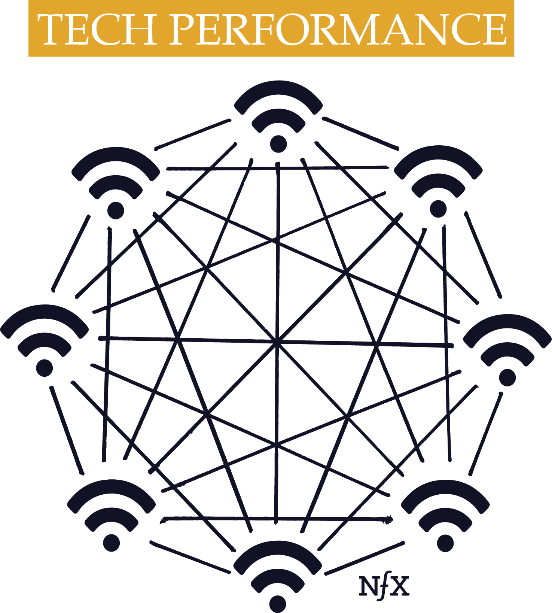
*Networks with tech performance nfx become better (faster, cheaper, or easier to use) the bigger they get. As more nodes (devices) join the network, the performance of the whole improves.  具备技术性能网络效应的网络越大就会变得越好（更快、更便宜或者更易用）。加入网络的节点（设备）越多，整体性能改善就越好。*

Consider peer-to-peer file sharing services like BitTorrent, or VPN providers like Hola, or object finding mesh networks like Tile. These services get faster for all users the more nodes are on the network. Every person downloading a file from BitTorrent is also seeding files to the network. The more people who have a Tile app installed, the greater the chances that you can locate something you lost since every phone on the network is constantly scanning for tiles. Skype also claims that the more people using Skype, the better the video streaming quality (it’s not clear if this true, but it’s the right idea for them to have).

让我们考虑一些具体的例子：BitTorrent 这样的 P2P 文件共享服务，Hola 这样的 VPN 提供商，或 Tile 这样的物品寻找网状网络。这些服务随着网络节点的增加而变得更高效。在 BitTorrent 网络中，每个下载文件的用户同时也在向网络上传文件。Tile 应用的用户越多，你找到丢失物品的机会就越大，因为网络中的每部手机都在不断扫描寻找 tile 设备。Skype 也声称，使用其服务的人越多，视频流质量就越好（尽管这一说法的真实性尚不确定，但这确实是他们应该追求的方向）。

Tech Performance Network Effects are different from technological advances, and we would argue they are superior. Technological advantages have a short half-life and aren’t very defensible anymore. If you’re the first to come out with a technology, the rate of innovation ensures that it won’t be long until the competition either copies your technology or develops it themselves. But with Tech Performance nfx, your product gets a runaway advantage for being the first out of the gate. You don’t have to fight to keep your head start. Your lead tends to lengthen, not decrease, over time.

技术性能网络效应与普通的技术进步有所不同，我们认为前者更具优势。传统的技术优势往往半衰期短，现在已经不太具有防御性。如果你是某项技术的首创者，由于创新速度快，竞争对手很快就会复制或自行开发类似技术。但是通过技术性能网络效应，你的产品因为率先问世而获得了显著的优势。你不必为保持领先地位而不断奋斗。相反，你的领先优势往往会随时间推移而扩大，而非缩小。

The other common point of confusion with Tech Performance nfx is to assume its presence when increased usage produces revenue that can then be re-applied to produce more tech advances, driving even more usage. If a performance improvement comes from an increased volume of revenue or data … it might be a good thing to have… but it’s not tech performance nfx.

关于技术性能网络效应，还有一个常见的误解需要澄清。有人可能会认为，增加使用量产生的收入可以再投入到技术进步中，从而推动更多使用，这就是技术性能网络效应。然而，如果性能改进仅仅来自于收入或数据量的增加，虽然这可能是有益的，但它并不构成真正的技术性能网络效应。

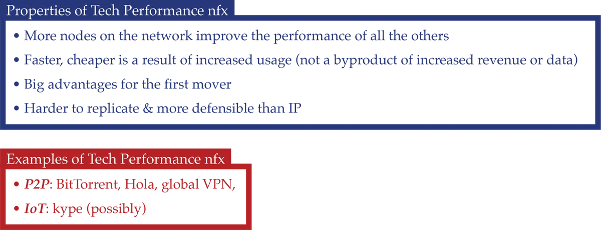

Properties of Tech Performance nfx

技术性能网络效应的特点

- More nodes on the network improve the performance of all the others  网络的节点越多可以改善其他节点的表现
- Faster, cheaper is a result of increased usage (not a byproduct of increased revenue or data)  更快、更便宜是使用增加的结果（而不是收入增加或数据增加的副产品）
- Big advantages for the first mover  先发优势巨大
- Harder to replicate & more defensible than IP  更难复制、比知识产权防御性更强

Examples of Tech Performance nfx

技术性能网络效应的实例

- P2P: BitTorrent, Hola, global VPN,  点对点传输：BitTorrent、Hola、全球代理网络
- IoT: Skype (possibly)  物联网：Skpye（也许）

## "Social" Network Effects  「社交互动」网络效应

The 5th and last broad category of network effects are what we’ve called "social" network effects. They work through psychology and the interactions between people.

第五大类，也是最后一大类网络效应，我们称之为「社交互动」网络效应（"social" network effects）。它们通过心理学和人与人之间的互动发挥作用。

Here’s how we think they work.

我们认为它的机制是这样的。

Networks are nodes and links. With a landline telephone system, it’s easy to see the physical phones and wires connecting them.

网络由节点和链接组成。在有线电话系统中，很容易看到物理电话和连接它们的线路。

However, there is an unseen network among people, where our physical bodies are the nodes, and our words and behaviors with each other are the connections. These are the original networks, if you will.

然而，人与人之间存在一个看不见的网络，我们的身体是节点，我们彼此之间的言行是连接。这些可以说是最原始的网络。

Like digital network effects, these social nfx can help create more value in your product for users the more people use it. People add value to each other by influencing them to think or feel differently. By providing triggers and confidence to use your product.  By reinforcing their choice to continue using your product.

像数字网络效应一样，使用的人越多，这些社交互动网络效应可以帮助你的产品为用户创造更多的价值。人们通过影响他人的思想或感受（触发用户使用产品的动机、增强用户对产品的信任、提升用户持续使用的粘性）来为彼此增加价值。

Social nfx are usually the hardest to deploy for long-term defensibility. However, if you *can* successfully get various forms of psychology on your side against a competitor, they can represent a significant advantage.

社交互动网络效应通常是最难部署以实现长期防御性的。然而，如果你*能*成功地让各种形式的心理学站在你这边对抗竞争对手，就会具备显著的优势。

Now you may be asking yourself “Aren’t these social nfx kind of like brand defensibility?” And you would be partially right. There certainly are similarities. They have to do with language and psychology. But we think there are important differences as well, which is why we’ve broken them out into a separate category.

现在你可能会问自己「这些社交互动网络效应是不是有点像另外一种防御能力——品牌（brand）？」某种程度上来说你是对的。确实有相似之处。它们都与语言和心理学有关。但我们认为也有重要的区别，这就是为什么我们把它们分成一个单独的类别。

To date, we’ve identified three main types of social network effects: language, belief, and bandwagon effects. That number could easily expand, since human psychology is complex and there are many kinds of social interactions that work very differently, and we continue to look for new types.

到目前为止，我们已经识别出三种主要的社交互动网络效应类型：语言网络效应、信念网络效应和从众网络效应。关于社交互动网络效应，肯定远远不止这三种了，因为人类心理是复杂的，很多种社会互动的机制都是不一样的，今后我们会继续寻找新的类型。

### Language (Social)  语言网络效应

In any human network, language is the main intermediary. It’s the protocol that all the nodes in a network use to interface with each other. For instance, the English language is a serviceable language, but it’s a lot more valuable considering that there are 1.5 billion people who speak it. That’s more than 15 times as many people who speak German. So even though speaking English doesn’t make you 15 times better at communicating than speaking German, the value to speakers is much higher as a result of the network.

在任何人际网络中，语言都是主要中介。语言是网络所有节点用来相互连接的协议。比方说，英语是一门可用于交流的语言，但考虑到讲英语的人高达 15 亿人，英语的价值就高得多了。这相当于说德语人数的 15 倍多。因此，尽管讲英语在沟通上不会比讲德语好 15 倍，但它作为网络的结果带给说话者的价值却要高得多。

That’s why, throughout history, language has displayed a “winner-take-most” tendency. People in the same political, social and economic units tend to coalesce around one language.

这就是为什么在整个历史长河中语言都展示出一种「赢家通吃」的趋势。处在同一个政治、社会及经济单元的人往往会倾向于使用同一种语言。

This concept extends to the jargon and vernacular of specific groups, from nations to corporations, teens to hipsters, economists to Google employees. As jargon gets adopted by more and more people, it becomes more valuable to all the other users.

这一概念还可以延伸到使用特定「行业黑话」和方言的群体，从国家到企业，从青少年到潮人，从经济学家到 Google 员工，莫不如此。随着「行业黑话」被越来越多的人接受，它对其他所有使用者来说也变得更有价值。

Startups can use the network effects of language to take advantage of that winner-take-most effect in at least two ways: first, in creating business category language; and second, in naming a company or product.

初创企业至少可以通过两种方式利用语言的网络效应，发挥赢家通吃的优势：第一，创造特定业务类别的语言；第二，为公司或产品命名。

With the first, if a Founder can help create a name for a business category and then be known as \#1 in that category, it gives them solid language nfx. Miller Beer did this in 1975 when they created the “lite beer” category. The same thing happened 1995 with the creation of the web “portals” category, which Yahoo! benefited from since it was leading the category at that time. We’ve seen this same language network effect recently with the creation of the “cryptocurrency” category. Bitcoin, being seen as #1, benefited the most: it still accounts for nearly 40% of all the market capitalization despite their being 100s of competing cryptocurrencies.

对于第一种，如果创始人可以帮助某个业务类别创建一个名字，然后被视为此类的 \#1 的话，就有了坚实的语言网络效应。1975年，米勒啤酒（Miller Beer）通过建立「淡啤（lite beer）」这种啤酒类别而获得了语言网络效应。1995 年同样的事情又发生在网络「门户网站（portals）」这个类别上，Yahoo! 因为创造了这样一个类别，并声称在该类中处于领先地位而受益。最近我们在「加密货币」这个类别的建立上也看到了一样的语言网络效应。被视为 \#1 的比特币受益最多：比特币占到了全部市值的将近 40%，尽管市面上有 100 多种相互竞争的加密数字货币。

In all these cases, the \#1 lost its crown eventually, which is why Language nfx are considered less strong than others. Nevertheless, for many years, their competitors would certainly complain about the unfair advantage of the company with Language Network Effects they wished they had themselves.

在所有这些案例中，最初的 \#1 最终都失去了自己的桂冠，这就是语言网络效应被认为比其他网络效应弱的原因。但不管怎样，在很多年的时间里，其竞争对手都会抱怨有着语言网络效应的公司所取得的不公平优势，他们希望自己也能拥有这种优势。

The second way companies typically take advantage of Language nfx is with company and product naming.

公司利用语言网络效应的第二种典型方式是公司和产品命名。

For instance, when “Googling” something became synonymous with searching for something on the Internet, it was a huge advantage for Google. *The language itself became an impediment to using a competitor.* When someone asks you to Google something, it’s both socially awkward and mentally jarring to pull out your phone and start using Bing.

比方说，当「Googling」某样东西变成了在互联网上搜索东西的同义词时，这就变成了 Google 的巨大优势。*语言本身就成为了使用竞争对手产品的障碍*。当有人让你 Google 某样东西时，你却掏出手机开始用 Bing，这不仅会给你带来社交上的尴尬，自己内心也会觉得哪儿不对劲。

It’s similar when someone says “grab an uber.” They’re giving you a social cue to use Uber, not Lyft. (BTW, entering the vernacular as a noun is probably not as powerful as entering as a verb. It would likely be better for Uber if more people said, “I’m going to uber over there,” which some already do, but If I were Uber, I would encourage that usage as best I could).

当某人说「叫一辆 Uber」时情况也类似。他们这么说其实是给你一条社交暗示，让你使用 Uber 而不是 Lyft。（顺便说一句，作为名词成为日常用语的威力比不上作为动词。如果更多的人说「我准备 uber 到那里」对 Uber 来说可能更好，有些人已经在这么讲了，不过要是我是 Uber 的话，一定会尽量鼓励大家都这么用）。

Another example: back in the day, to “xerox” something mean to photocopy it.

另一个例子：当年，「xerox」某个东西的意思就是复印某个东西。[^7]

[^7]: Ponge 注：xerox 是复印机公司施乐的英文。

Getting people to verbally use your company name is a big advantage, but it’s very tricky to do. Your company name has to be memorable and catchy enough to do this, and that’s why [getting the name right is so crucial](https://www.nfx.com/post/your-company-name-matters).

让大家把你公司的名字当做动词使用是一大优势，但想做到这一点是比较棘手的。你的公司名字必须好记而且要朗朗上口，所以[取好名字非常关键](https://www.nfx.com/post/your-company-name-matters)。

Properties of Language nfx

语言网络效应的特点

- Direct network effect: the more people who use a term, the more valuable it becomes  直接网络效应：某术语使用的人越多，价值就越大
- Good defensibility, because at most there's one brand name that people will verbalize.  很好的防御性，因为大家顶多只会把一个品牌名字动词化
- If you think about language as having network effects, it has important implications for international markets.  如果你认为语言有网络效应，则语言对国际市场会有重要意义
- Anglophone countries will always be easier to penetrate for an English-language company with an English-friendly brand name.  采用英语、有着英文友好型名字的公司永远更容易渗透到英语为母语的国家

Examples of Language nfx

语言网络效应的实例

- Company names: Uber, Google, Xerox,  公司名：Uber、Google、施乐
- Category names: Lite Beer, Yahoo! portal, Bitcoin cryptocurrency  类别名：淡啤、Yahoo! 门户、比特币加密货币
- Broad language networks: Language families, individual languages, dialects  广泛语言网络：语系、单个语言、方言
- Local language networks: teen slang, company jargon, other niche group terminology  本地语言网络：青少年俚语、公司行话、其他利基群体黑话

### Belief (Social)  信念网络效应

The 13th network effect on our current Map is belief. The belief network effect is something you can best see with gold, Bitcoin and religion. It’s a direct nfx.

第 13 种[^8]网络效应是信念（Belief）。信念网络效应这种东西在黄金、比特币和宗教身上体现得最明显。这是直接的网络效应。

[^8]: Ponge 注：没有改过来，应该是第 14 种。

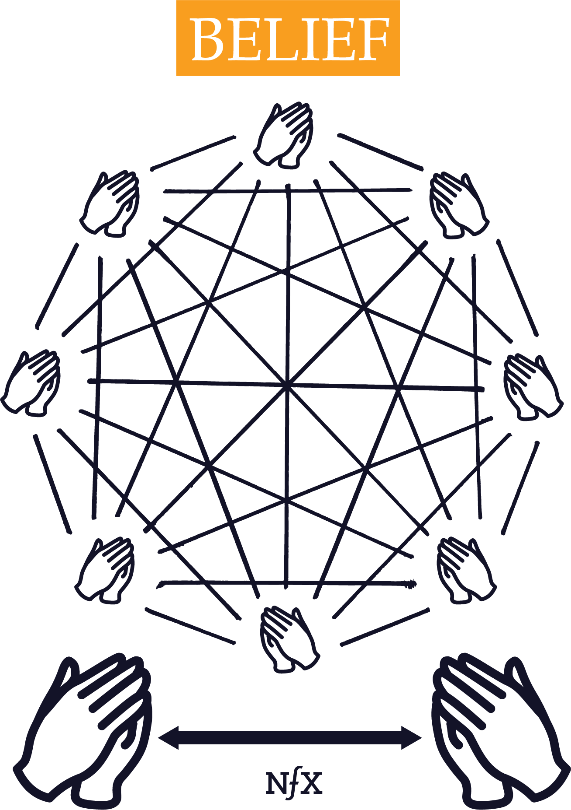

*Homo Sapiens* is a pack animal. We want to be in the “in group” and be accepted by others. Sharing common beliefs is a critical part of that. If people believe in something, others are more likely to stick with it and believe in it, too. As a result, there are big social consequences for not believing the things your friends believe, and perhaps worse consequences for ceasing to believe in what they believe. This is one factor that makes people stick with group thoughts, making them very resilient to contradictory information.

*智人*（Homo Sapiens）是一种群居动物。我们希望成为「圈内人」并被他人接受。共享共同的信念是其中的关键部分。如果人们相信某些东西，其他人也更可能坚定对它的信念。因此，不相信你朋友相信的东西，会带来很大的社交影响，而信过但不再信他们相信的东西，可能会带来更严重的后果。信念是让人们在思想上更容易「随大流」的一个因素，这使得人们对于矛盾的信息非常有抵抗力。

Most importantly, *beliefs become more valuable to believers the more people believe.*

更重要的是，*对信徒来说，越多人相信，信念就越有价值*。

Look at gold. Why is it valuable? You can’t eat it or sleep on it. It’s pretty, but lots of things are pretty. It has some industrial uses, but not that many. It’s valuable because — after we were done believing salt was valuable — people decided to believe gold was valuable instead. And for 5,000+ years, it has always stayed valuable. The past gives us confidence that everyone will continue to hold this belief in the future. That belief strengthens over time.

看看黄金。为什么黄金值钱？黄金又不能当饭吃、当床睡。黄金是很好看，可好看的东西多了。黄金有点工业用途，但不是很多。黄金之所以值钱，是因为——在我们把盐看成是贵重品之后——现在大家决定值钱的是黄金了。而且在 5000 多年的时间里，黄金一直都是值钱的。黄金过去的历史给了我们信心，我们相信将来每个人仍然会坚定这一信念。这种信念会随着时间的推移而增强。

*Ipso facto*, gold is valuable because we believe it’s valuable.

*毋庸置疑*，黄金之所以值钱，是因为我们相信它值钱。

Belief nfx are like sand. In small quantities, sand dissipates in a breeze. But if you layer enough sand down on top of itself, it becomes hard as stone.

信念网络效应就像沙子这东西一样。少量的沙子会在微风中消散。但如果你把足够多的沙子堆砌到一起，它就会硬得像块石头一样。

The same is true of Bitcoin. The more people believe it’s valuable, the more valuable it gets for everyone. And we’re seeing that same “sand layering” with Bitcoin now. The more times its price crashes and then bounces back, the more people will believe it has value. And then when you layer some Ethereum “sand” on top of it, and the “sand” of the thousands of other cryptocurrencies in existence — all denominated in Bitcoin on the exchanges — the Bitcoin sand gets progressively more stable as a result of growing Belief nfx. What was once fluid and intangible transforms to something closer to rock.

比特币也是这种情况。相信它有价值的人越多，它对每个人的价值就越高。现在在比特币身上我们正目睹着同样的「聚沙成塔」效应。比特币价格崩溃然后反弹的次数越多，相信它有价值的人就会越多。当你在此基础再堆点以太坊的「沙子」以及成千上万种现存的其他加密货币的「沙子」上去时（所有这些币种在交易所中都存在兑比特币的交易对），作为不断发展的信念网络效应的结果，比特币沙堆就会慢慢就变得稳定起来。曾经流动和虚无缥缈的东西就变成了接近于岩石一样的东西。

Properties of Belief nfx

信念网络效应的特点

- The social consequences of a belief with belief nfx exceed the other consequences of that belief  当一种信念具有网络效应时，它所带来的社会影响往往超过了该信念本身的其他影响。换句话说，人们持有这种信念所产生的社会连带效应，比信念本身的实际内容或后果更为重要。
- Self-reinforcing: the more people believe in the value of something, the more valuable that thing is in reality (for the believers)  自我强化：相信某个东西价值的人越多，现实中那个东西的价值越高（对于信徒来说）

Examples of Belief nfx

信念网络效应的实例

- currencies  货币
- religions  宗教
- ideologies  意识形态

### Bandwagon (Social) 「跟风」网络效应

Bandwagoning happens when social pressure to join a network causes people to feel they don’t want to be left out.

当加入网络的社会压力导致人们不想被排除在外时，就会出现「跟风（Bandwagon）」的现象。

One good example is Slack. In tech circles, it’s commonly felt that you don’t have a modern company unless your teams are using Slack. In our opinion, Slack’s notoriety and valuation have exceeded the utility of the product because it’s become somewhat of a movement in the tech industry, and developed a strong Bandwagon nfx.

Slack 就是一个很好的例子。在技术圈，一个普遍的感觉是如果你的团队不用 Slack 的话就算不上是一家现代公司。在我们看来，Slack 的知名度和估值已经超过了该产品的实际功能，因为它在某种程度上已经成为科技行业的一场运动，并且形成了强烈的「跟风」网络效应。

Bandwagon nfx typically arise when a network first begins aggregating, when people are jumping on early. When people started to use Google back in 1998, there was a general feeling that “the cool kids” were using Google (they had been using Alta Vista before that). If you didn’t use Google, you were left out. Other nfx have since taken over for Google to provide them their core defensibility, so they’re no longer reliant on that initial Bandwagon nfx, but it certainly was there at the beginning.

「跟风」网络效应通常在网络开始形成初期出现，那时候有些人会在早期加入进来。1998年，当人们开始使用谷歌时，普遍认为「酷盖（the cool kids）」们会用谷歌（他们之前一直在使用Alta Vista）。如果你不使用谷歌，你就会感到与主流脱节。随着时间推移，其他类型的网络效应逐渐取代了最初的「跟风」效应，为谷歌提供了核心竞争优势。因此，谷歌不再依赖最初的「跟风」网络效应，但这种效应确实在公司发展初期发挥了重要作用。

One company that *has* made Bandwagon nfx a core expertise is Apple. Every year, with a carefully scripted performance, they re-manufacture buzz and FOMO with their new product demos and launches. This has been extremely effective. These days, if you show up at a meeting in Silicon Valley with an IBM clone instead of an Apple computer, it’s a sign you’re not part of the tribe. You’re seen as an outsider if you don’t use a Mac.

有一家公司把「跟风」网络效应*玩成了*自己的核心能力，这家公司就是苹果。每一年苹果都会精心打造一场演出，用新产品演示和发布来重新制造口碑和 FOMO（害怕错过）情绪。这种策略极为有效。如今，如果你带着一台非苹果的个人电脑（比如 IBM）出现在硅谷的会议上，这就会被视为你不属于这个圈子的信号。在这里，不使用 Mac 的人往往会被当作局外人。

This can be frustrating for competitors who feel they have better products, but can’t beat Apple for reasons that remain hidden to them. Apple’s success goes beyond “branding.” It relies on successfully triggering the psychological need to be part of the cool crowd, to join the movement.

这对于竞争对手来说可能是令人沮丧的，他们觉得自己的产品更好，但却无法击败苹果，原因对他们来说仍然是个谜。苹果的成功不仅仅在于「品牌」，它成功地激发了人们想要成为酷炫群体一员、加入这场运动的心理需求。

[This video](https://www.youtube.com/watch?v=FL7yD-0pqZg) from 2010 is a hilarious depiction of the frustration and confusion competitors have about the mechanisms behind Apple’s dominance, and here’s a [2017 Samsung ad campaign](https://www.youtube.com/watch?v=yxuHJv1_big) which is a cry into the same void: trying to tell consumers it’s time to “grow up” from their childish, emotional attachment to the iPhone given the Samsung makes a “better” product. But what they’re missing is that the value to the user is not just the sum of the product features, not just a function if it’s aggregated utility. It includes the value of the network derived from other product users, and the social value of the bandwagon it lets them join.

2010 年的[这个视频](https://www.youtube.com/watch?v=FL7yD-0pqZg)生动地描绘了竞争对手对苹果主导地位背后机制的沮丧和困惑。[三星在 2017 年的一则广告](https://www.youtube.com/watch?v=yxuHJv1_big)同样打在了棉花上：三星想要告诉消费者，时候从他们对 iPhone 的盲目崇拜中「走出来」了，因为三星制造了一个「更好」的产品。然而，他们忽视了一个关键点：对用户来说，产品的价值不仅仅是功能的总和，也不仅仅是其综合体验的简单加总。这种价值还包括两个重要方面：一是源自其他产品用户的网络价值，二是加入这个流行趋势所带来的社会价值。

[Here’s a video](https://www.youtube.com/watch?v=fW8amMCVAJQ) which does a good job explaining Bandwagon nfx. Derek Sivers captures the essence of bandwagon psychology when he says “[they will be part of the in-crowd if they hurry](https://youtu.be/fW8amMCVAJQ?t=1m36s).” He then goes on to deftly explain that “the rest \[join since they\] prefer to stay part of the crowd, because eventually they would be ridiculed for not joining.” The whole video bears watching.

这里[有一段视频](https://www.youtube.com/watch?v=fW8amMCVAJQ)很好地解释了「跟风」网络效应。Derek Sivers 抓住了「跟风」心理的精髓，他说：「[如果他们赶紧加入，他们就会成为那群人中的一员。](https://youtu.be/fW8amMCVAJQ?t=1m36s)」然后他巧妙地解释道：「剩下的人也只好加入了，因为如果不加入的话就会成为被嘲笑的对象。」整个视频都值得一看。

Students of nfx will correctly note that Bandwagon Effects can go too far. If *too* many people join a movement, sometimes the early adopters will abandon it because the group has become too mainstream. That’s why you typically see the Bandwagon nfx at the beginning of products. Smart Founders will navigate that transition from bandwagon to other nfx to maintain long-lasting defensibility.

网络效应的研究者会正确地意识到，「跟风」网络效应可能会*盛极而衰*。如果有太多人加入一个流行趋势，有时一些早期积极分子就会抛弃它，因为这个群体已经太主流了。这就是为什么我们通常会在产品初期观察到「跟风」网络效应。聪明的创始人会巧妙地引导产品从初期的「跟风」效应过渡到其他类型的网络效应，以维持长期的竞争优势。

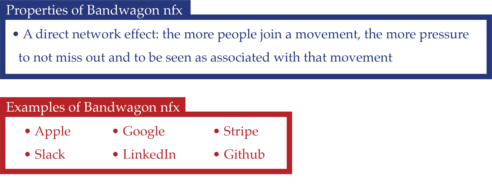

Properties of Bandwagon nfx

「跟风」网络效应的特点

- A direct network effect: the more people join a movement, the more pressure to not miss out and to be seen as associated with that movement  直接网络效应：参加运动的人越多，不要错过、成为其中一份子的压力就越大

Examples of Bandwagon nfx

「跟风」网络效应的实例

- Apple
- Google
- Stripe
- Slack
- LinkedIn
- Github

### Tribal (Social) 组织网络效应

Tribal network effects most often develop in alumni networks of schools, military units, fraternities and sororities, accelerators, languages, regions, and religions.

组织网络效应（Tribal network effects）最常见于学校校友网络、军事单位、兄弟会和姐妹会、创业孵化器、语言群体、地域社群和宗教团体中。

We suspect this was the very first network effect historically, as Homo sapiens evolved as a pack animal, trying to survive. The ones that built the best tribes survived to procreate, so we are all descendants of the best tribe builders. Those who weren’t good at building or joining tribes died off. Thus, our brains are wired to join tribes.

从历史角度来看，我们推测这可能是最早出现的网络效应。作为群居动物，智人在进化过程中不断尝试生存。那些能够建立最强大部落的个体得以存活并繁衍后代，因此我们都是最优秀的部落建设者的后裔。不善于建立或加入群体的个体则被自然淘汰。这就解释了为什么我们的大脑天生就倾向于加入一个组织。

A few key things contribute to the formation of strong Tribal network effects:

有几个关键因素有助于形成强大的组织网络效应：

1.  The tribe is presented as an ingredient of a person’s identity, part of how that person is perceived by others. One might think: “It’s who I am.” This forms a self-concept. 组织被视为个人身份的重要组成部分，影响他人对这个人的看法。人们可能会认为：「我就是各种组织角色的集合体」。这形成了自我概念。
2.  Network members within the tribe are taught to be intentional about building the value of the tribe by:   组织内的成员被引导要有意识地通过以下方式提升组织的价值：
    a. adding value to other tribe members,   为其他成员创造价值
    b. defending the tribe’s reputation,   维护组织的声誉，
    c. receiving value from the tribe members, and   从其他成员那里获得价值
    d. growing the tribe.   扩大组织规模
	This intentional value creation and defense of a network is distinct from other types of network effects, where nodes largely contribute value and drive network effects unintentionally.  这种有意识的价值创造和网络维护与其他类型的网络效应有所不同，在其他类型的网络效应中，节点主要是无意识地贡献价值和推动网络效应。
3.  In contrast to the in-group of the tribe, there is an out-group that the tribe is actively NOT. A different group, a rival, an enemy, a force to be fought.  与组织内部成员形成鲜明对比的是外部群体，组织会积极与之区分。这可能是一个不同的群体、竞争对手、敌人，或需要对抗的力量。
4.  A perception of higher-status attributes of members of the tribe, creating prestige and pride. Evidence or reasoning that members of the tribe are more committed, more “right”, more justified, smarter, stronger, etc.  组织成员被认为具有较高的地位特质，这创造了声望和自豪感。有证据或理由表明组织成员更加投入、更「政治正确」、更有道理、更聪明、更强大等。
5.  Members of the tribe endure shared hardship or adversity, such as training for the marines, studying for tests in college, founding a company, or going through a boot camp of some kind.  组织成员共同经历艰难或逆境，如海军陆战队的训练、大学考试的备考、创办公司或参与某种强化训练营。
6.  Tribe network members overcome a barrier to get into the tribe. There must be a believable reason for your inclusion, and some demonstration of your worth or “fitness” for inclusion. There is often a period of worrying you won’t “get in.” This creates exclusivity and belonging in the minds of the tribe members, reinforcing the other five attributes. 组织成员需要克服障碍才能加入。必须有合理的理由解释为何被接纳，以及展示自己的价值或「适合」加入。通常会经历一段担心无法「被接纳」的时期。这在成员心中创造了独特性和归属感，从而强化了其他五个特征。

Not all tribes share all six of these characteristics, but the more they do, the more powerful the tribal self-identification becomes in the minds of the tribe members, and thus the stronger the Tribal network effect.

并非所有组织都具备这六个特征，但拥有的特征越多，组织成员心中的自我认同就越强烈，因此组织网络效应也就越强。

As with other network effects, network size and network density also matter in the formation and strength of Tribal network effects. The larger the tribe, up to a point, the more valuable it becomes because you are more likely to encounter and form relationships with other nodes. College alumni networks, for example, often have clusters in many different cities and companies where alumni seek each other out. Tribal networks also have a higher density of relationships between nodes because self-identification between tribe members causes them to look for shared affinities, and motivates them to altruistic behavior towards other nodes in the network.

与其他网络效应类似，网络规模和网络密度对组织网络效应的形成和强度也很重要。在一定程度上，组织规模越大，其价值就越高，因为成员更有可能遇到并与其他成员建立关系。例如，大学校友网络通常在多个城市和公司中形成小团体，校友们会主动寻找彼此。组织网络中成员之间的关系密度也更高，这是因为成员间的自我认同驱使他们寻找共同点，并激励他们对网络中的其他成员表现出利他行为。

That, in turn, leads to a higher proportion of shared connection between tribe members than in other types of networks, which incentivizes further relationship-formation and sets off a virtuous cycle. In a tribal network, people (often unconsciously) recognize that potential connections are more likely to materialize into actual connections, causing a self-fulfilling propensity to try harder to build in-tribe network connections. This creates a denser lattice of links between the nodes, driving network effects, and network value.

这反过来又会导致组织成员之间的共同联系比例高于其他类型的网络，进而促进了更多关系的形成，形成良性循环。在组织网络中，人们（通常是无意识地）认识到，潜在的联系更有可能转化为实际的联系，从而产生一种自我实现的倾向，这使他们更倾向于努力建立组织内的网络联系。这创造了成员之间更紧密的关系网络，从而推动了网络效应和网络价值的增长。

[Read the full essay here](https://www.nfx.com/post/15th-network-effect-tribal/)

关于组织网络效应的更多内容，可以阅读[这篇文章](https://www.nfx.com/post/15th-network-effect-tribal/)。

## The power of network effects  网络效应的力量

We explained earlier the Network Effects Map is meant to be a discussion starter on the true nature of network effects, not a last and final word on the subject. Network effects are a complex phenomenon that look simple on the surface.

我们在前面已经解释过，网络效应地图旨在引发人们对网络效应真实本质的讨论，而不是对这一主题的最后定论。网络效应是一种表面上看似简单的复杂现象。

With this manual, we’re trying to communicate the importance, variety, and complexity of network effects. Top Founders will benefit from a deeper understanding of network effects which will translate to better practical business decisions. In the end, defensibility is what will define the success of your business. More than anything else, network effects are the key to that success.  

通过本手册，我们试图传达网络效应的重要性、多样性和复杂性。顶尖的创始人将会因为对网络效应有着深刻理解而获益，从而做出更好的实际商业决策。归根结底，抵御竞争的能力将决定企业的成败。而这方面网络效应比任何其他东西都要关键。